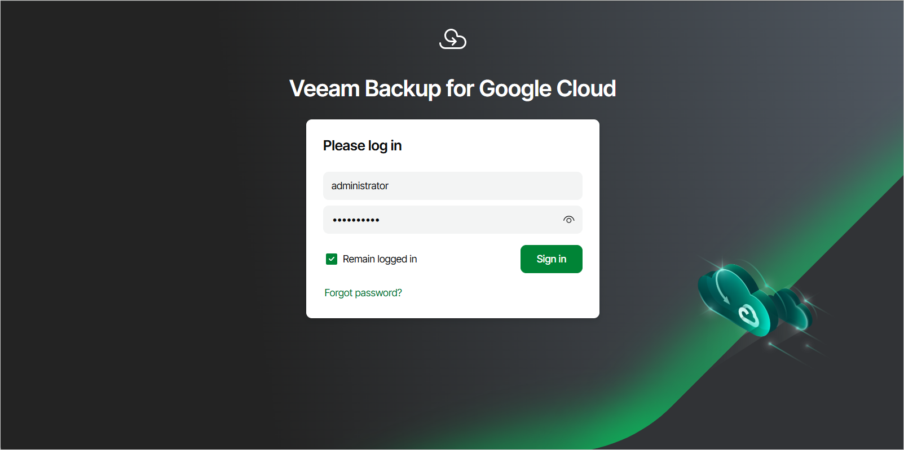

# Accessing Web UI from Workstation

To access the Veeam Backup for Google Cloud Web UI from a workstation, do the following:

1. In a web browser, navigate to the Veeam Backup for Google Cloud web address.

|  |
| --- |
| Important |
| Internet Explorer is not supported. To access the Veeam Backup for Google Cloud Web UI, use Microsoft Edge (latest version), Mozilla Firefox (latest version) or Google Chrome (latest version). |

The address consists of a public IPv4 address or DNS hostname of the backup appliance. Note that the website is available over HTTPS only.

|  |
| --- |
| Note |
| The web browser may display a warning notifying that the connection is untrusted. To eliminate the warning, you can replace the TLS certificate that is currently used to secure traffic between the browser and the backup appliance with a trusted TLS certificate. To learn how to replace certificates, see [Replacing Web Certificates](replacing_security_certificates.md). |

1. In the Username and Password fields, specify credentials of an authorized user account.

If you log in for the first time, use credentials of the Default Administrator account that was created after the product installation. In future, you can add other user accounts to grant access to Veeam Backup for Google Cloud. For more information, see [Managing User Accounts](managing_permissions.md).

|  |
| --- |
| Tip |
| If you do not remember the password, you can reset it. To do that, click the Forgot password? link and follow the instructions provided in [this Veeam KB article](https://www.veeam.com/kb4061). |

1. Select the Remain logged in check box to save the specified credentials in a persistent browser cookie so that your session does not expire after 60 minutes of inactivity.

If you select this check box, you will be logged in for 7 days and will not have to provide credentials every time you access the Veeam Backup for Google Cloud Web UI in a new browser session.

1. Click Log in.

If [multi-factor authentication (MFA) is enabled](enabling_mfa.md) for the user, Veeam Backup for Google Cloud will prompt you to enter a code to verify the user identity. In the Verification code field, enter the temporary six-digit code generated by the authentication application running on your trusted device. Then, click Log in.

Logging Out

To log out, at the top right corner of the Veeam Backup for Google Cloud window, click the user name and then click Log out.

