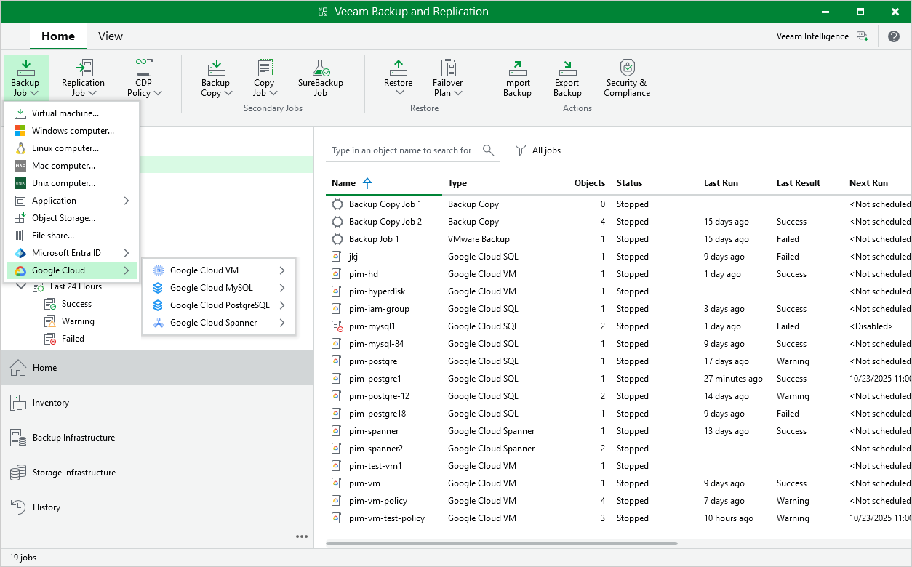

In this article

You can create backup policies in the Veeam Backup for Google Cloud Web UI only. However, you can launch the Add Policy wizard directly from the Veeam Backup & Replication console — to do that, use either of the following options:

* Switch to the Home tab, click Backup Job on the ribbon, navigate to GCP > GCP VM, GCP SQL, GCP PostgreSQL or GCP Spanner, and select the backup appliance on which you want to create the backup policy.
* Open the Home view, right-click Jobs, navigate to Backup > GCP > GCP VM, GCP SQL, GCP PostgreSQL or GCP Spanner, and select the backup appliance on which you want to create the backup policy.

Veeam Backup & Replication will open the Add VM Policy, Add Cloud SQL Policy or Add Cloud Spanner Policy wizard in a web browser. Complete the wizard as described in section [Creating VM Backup Policies](backup_policy_name.md), [Creating Cloud SQL Backup Policies](sql_policy_name.md) or [Creating Cloud Spanner Backup Policies](spanner_policy_name.md).

Page updated 11/13/2025

Page content applies to build 7.0.0.47
