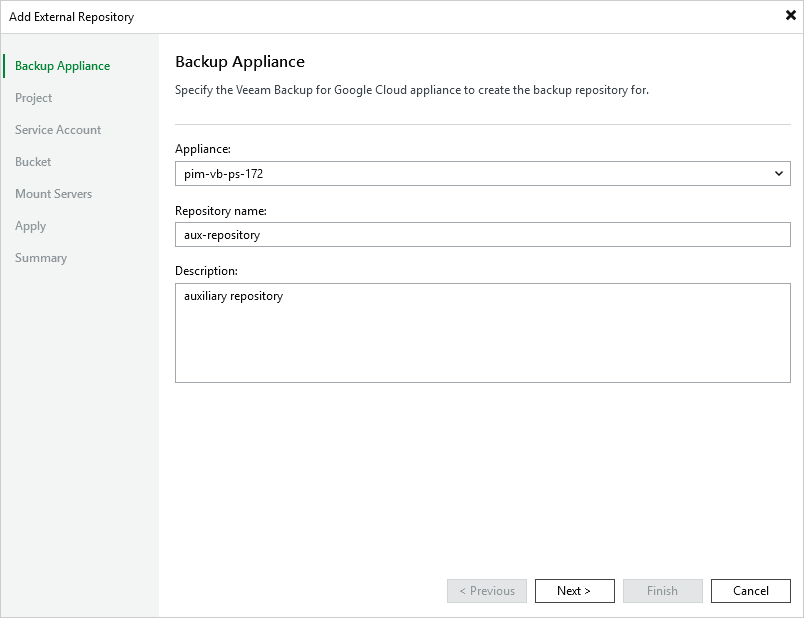

In this article

At the Veeam Backup for GCP step of the wizard, do the following:

1. From the Appliance drop-down list, select a backup appliance that will manage the repository.

For an appliance to be displayed in the Appliance drop-down list, it must be added to the backup infrastructure as described in section [Adding Appliances](adding_appliances.md).

1. Use the Repository name and Description fields to enter a name for the new repository and to provide a description for future reference. The maximum length of the name is 127 characters; the following characters are not supported: \ / " ' [ ] : | < > + = ; , ? \* @ & \_ .

Veeam Backup & Replication will create a folder with the specified name in the storage bucket that you will specify at [step 5](add_repo_bucket.md) of the wizard. This folder will be used to store backed-up data.

Page updated 11/14/2025

Page content applies to build 7.0.0.47
