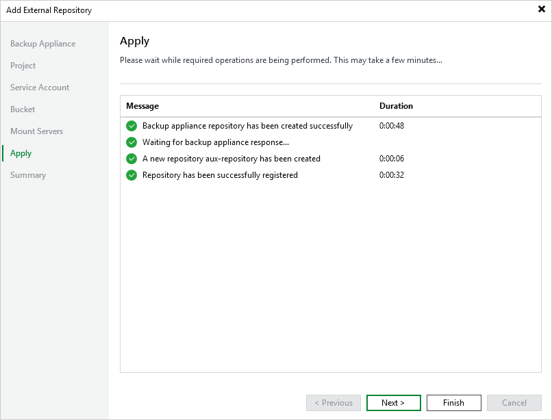

# Step 7. Track Progress

Veeam Backup & Replication will display the results of every step performed while creating the repository. At the Apply step of the wizard, wait for the process to complete and click Next.

