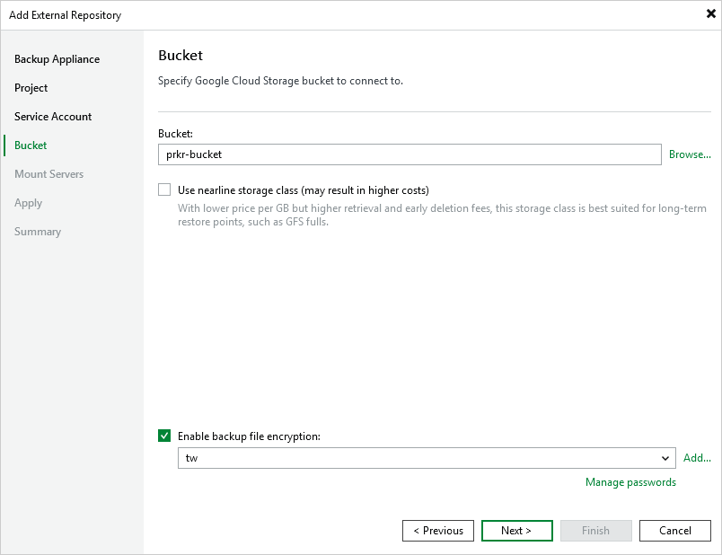

# Step 5. Configure Repository Settings

At the Bucket step of the wizard, do the following:

1. Choose whether you want to use an existing bucket or to create a new one as the target location for image-level backups of VM, Cloud SQL and Cloud Spanner instances:

* To specify an existing bucket, enter the name of a storage bucket where the repository will be created.

Alternatively, click Browse and select the necessary bucket in the Select Bucket window. For a bucket to be displayed in the Bucket list, it must be created in the Google Cloud for the project specified at [step 3](add_repo_project.md) of the wizard, as described in [Google Cloud documentation](https://cloud.google.com/storage/docs/creating-buckets).

* [Applies only if you have specified the project to which the backup appliance belongs] To create a new bucket, click Browse. In the Select Bucket window, click New Bucket and enter a name for the bucket. Veeam Backup & Replication will automatically create a bucket in the same region where the backup appliance resides.

1. [Applies only if you have chosen to create a standard repository] When you create a standard repository, backups are stored in a high-performance, short-term Standard storage class by default. To store backups in a cost-effective, high-durable Nearline storage that you plan to access infrequently, select the Use nearline storage class check box. Note that after the repository is created, you will not be able to change its storage class.

1. Use the Enable backup file encryption check box to choose whether you want to encrypt backups stored in the created repository. If you enable encryption, also specify a password that will be used to encrypt data.

For a password to be displayed in the list of available passwords, it must be added to the backup infrastructure as described in the Veeam Backup & Replication User Guide, section [Creating Passwords](https://helpcenter.veeam.com/docs/vbr/userguide/password_manager_create.html?ver=13). If you have not added the necessary password beforehand, you can do it without closing the Bucket wizard. To do that, click either the Manage passwords link or the Add button, and specify the password and hint in the Password window.

|  |
| --- |
| Important |
| After you create a repository with encryption enabled, you will not be able to disable encryption for this repository. However, you will still be able to change the encryption settings as described in section [Editing Backup Repositories](editing_repositories.md). |

