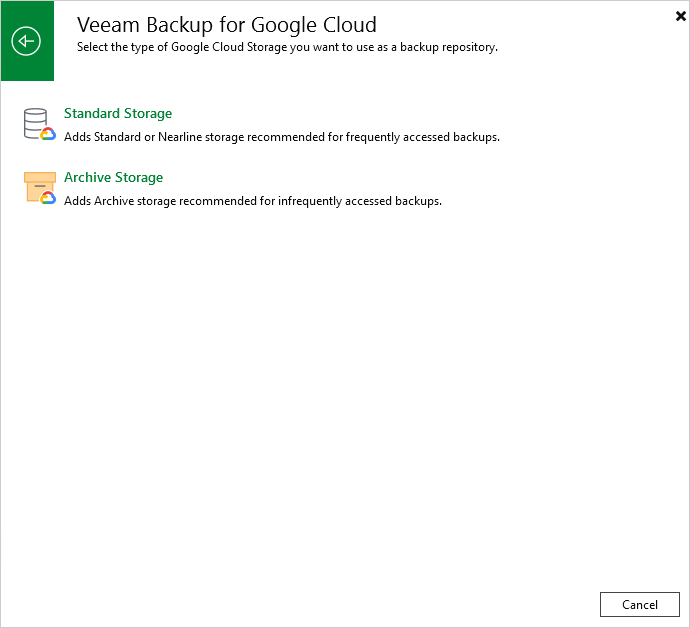

# Step 1. Launch Add External Repository Wizard

To launch the Add External Repository wizard, do the following:

1. In the Veeam Backup & Replication console, open the Backup Infrastructure view.
2. Navigate to External Repositories and click Add Repository on the ribbon.

Alternatively, you can right-click the External Repositories node and select Add.

1. In the Add External Repository window:

1. [Applies only if you have several cloud plug-ins installed] Click Veeam Backup for Google Cloud.
2. Choose whether you want to create a standard or an archive repository:

* Select the Standard Storage option if you want to create a repository with the Standard or Nearline storage class assigned.
* Select the Archive Storage option if you want to create a repository with the Archive storage class assigned.

