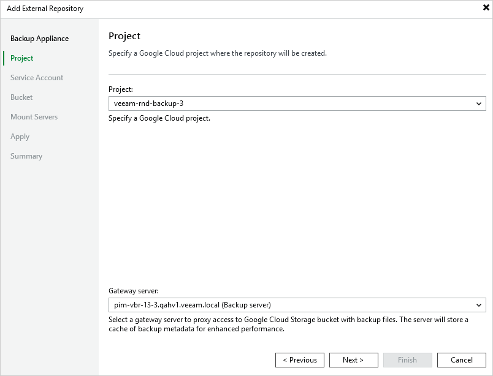

In this article

At the Project step of the wizard, do the following:

1. From the Project drop-down list, select a project to which the new repository will belong.

For a project to be displayed in the Project list, it must be added to the backup appliance as described in section [Adding Projects and Folders](adding_projects.md).

1. [Applies only if you have chosen to create a standard repository] From the Gateway server drop-down list, select a gateway server that will be used to access the repository.

For a server to be displayed in the Gateway server list, it must be added to the backup infrastructure. For more information on gateway servers, see [Architecture Overview](architecture_overview.md).

Page updated 11/14/2025

Page content applies to build 7.0.0.47
