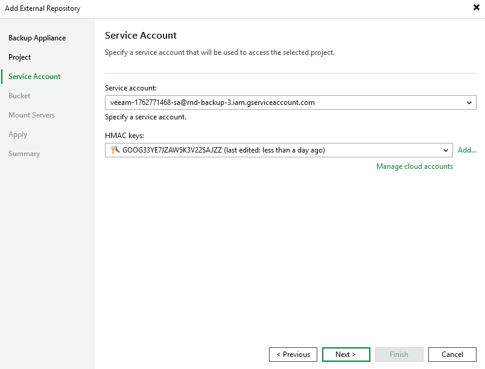

In this article

At the Service Account step of the wizard, do the following:

1. From the Service account drop-down list, select a service account whose permissions will be used to access the project specified at [step 3](add_repo_project.md) of the wizard.

For a service account to be displayed in the list of available accounts, it must be added to the selected backup appliance as described in section [Adding Service Accounts](adding_service_accounts.md).

1. From the HMAC keys drop-down list, select a Hash-based Message Authentication Code (HMAC) key that will be used by Veeam Backup & Replication to authenticate requests to the repository. The specified HMAC key can belong to any service account that has permissions to access the project specified at [step 3](add_repo_project.md) of the wizard.

For an HMAC key to be displayed in the Credentials list, it must be added to the Cloud Credentials Manager as described in the Veeam Backup & Replication User Guide, section [Google Cloud Accounts](https://helpcenter.veeam.com/docs/vbr/userguide/cloud_credentials_google.html?ver=13). If you have not added the necessary key to the Cloud Credentials Manager beforehand, you can do it without closing the Add External Repository wizard. To do that, click either the Manage accounts link or the Add button, and specify the HMAC key access ID and secret in the Credentials window.

|  |
| --- |
| Note |
| As the backup appliance also needs an HMAC key to authenticate its requests to the repository, Veeam Backup & Replication will verify whether the selected service account has an associated HMAC key saved in the configuration database of the appliance. If the account has no associated HMAC key or the associated HMAC key is not valid, Veeam Backup & Replication will verify whether the selected HMAC key belongs to the selected service account. If yes, Veeam Backup & Replication will add this key to the configuration database of the backup appliance. If no, Veeam Backup & Replication will generate a new HMAC key for the selected account and add this key to the appliance configuration database. |

Page updated 11/18/2025

Page content applies to build 7.0.0.47
