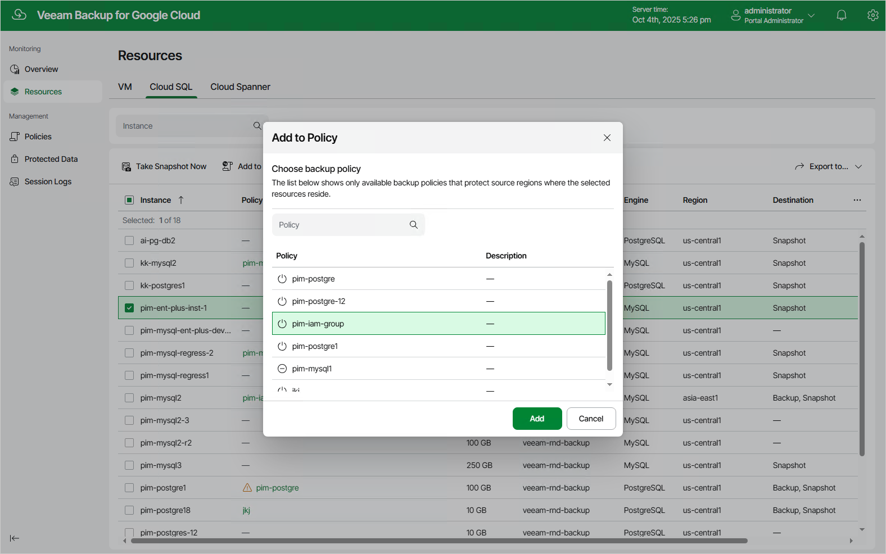

# Adding Resources to Policies

If you want to include additional resources (VM, Cloud SQL or Cloud Spanner instances) in the existing backup policies, you can either [edit the backup policy settings](editing_backup_policies.md) or quickly add the resources to the policies on the Resources page.

To add a Google Cloud resource to a backup policy, do the following:

1. Navigate to the necessary tab and select the resource.

For a resource to be displayed in the list of available instances, the Google Cloud region in which the resource resides must be specified in any of the configured backup policies, and the service account specified in the backup policy settings must have permissions to access the resource.

1. Click Add to Policy.
2. In the Add to Policy window, select a backup policy that will protect the resource, and click Add.

For a backup policy to be displayed in the list of available policies, the Google Cloud region in which the selected resource resides must be specified in the backup source settings, and the service account used by Veeam Backup for Google Cloud to perform backup must have permissions to access the resource.

1. In the Results window, click OK.

