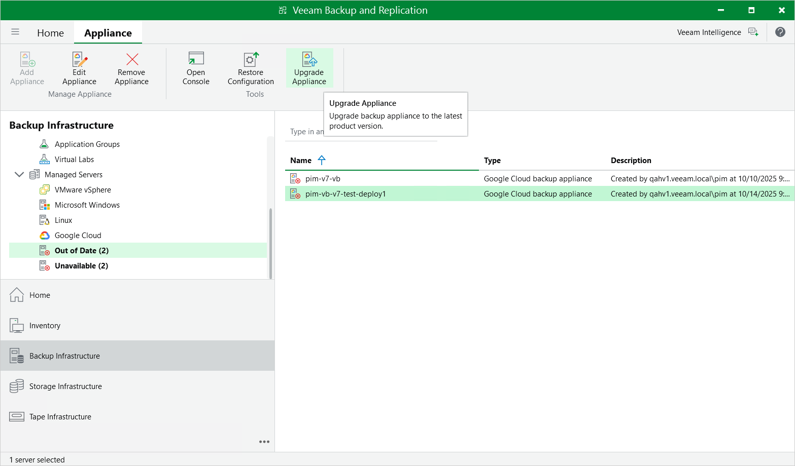

In this article

Starting from Veeam Backup for Google Cloud version 6, you can upgrade backup appliances in the Veeam Backup & Replication console only. To perform upgrade of Veeam Backup for Google Cloud to version 7, the backup appliance must be running version 5.0 or later.

|  |
| --- |
| Important |
| Consider that when you upgrade the backup appliance from version 5.0 to version 7, this process involves the upgrade of the backup appliance operating system and the configuration database version. For more information on the upgrade process and its prerequisites, see [Upgrading to Version 7 from Version 5](vbgc_update_from_v5.md). |

Veeam Backup & Replication allows you to download and install new available Veeam Backup for Google Cloud versions and product updates:

1. In the Veeam Backup & Replication console, open the Backup Infrastructure view.
2. Navigate to Managed Servers.
3. Select the necessary backup appliance and click Upgrade appliance on the ribbon.

Alternatively, right-click the appliance and select Upgrade.

Related Topics

[Upgrading to Version 7 from Version 6](upgrade_vb_console.md)

Page updated 12/5/2025

Page content applies to build 7.0.0.47
