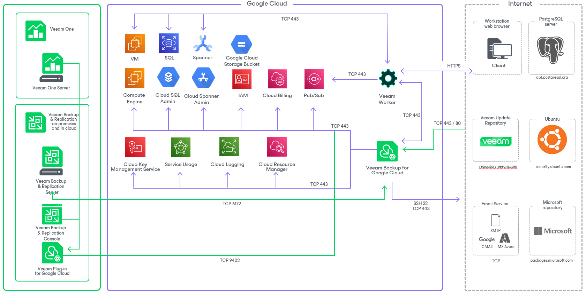

In this article

The Veeam Backup for Google Cloud architecture includes the following components:

* [Backup server](backup_server.md)
* [Google Cloud Plug-in for Veeam Backup & Replication](google_plugin.md)
* [Backup appliances](backup_appliances.md)
* [Backup repositories](backup_repositiories.md)

* [Worker instances](overview_worker_instances.md)
* [Additional repositories and tape devices](additional_repos_and_tape_devices.md)
* [Gateway servers](gateway_servers.md)
* [Mount Servers](vbgc_mount_servers.md)

Related Topics

* [Ports](ports.md)
* [Google Cloud APIs](google_cloud_apis.md)

Page updated 12/8/2025

Page content applies to build 7.0.0.47
