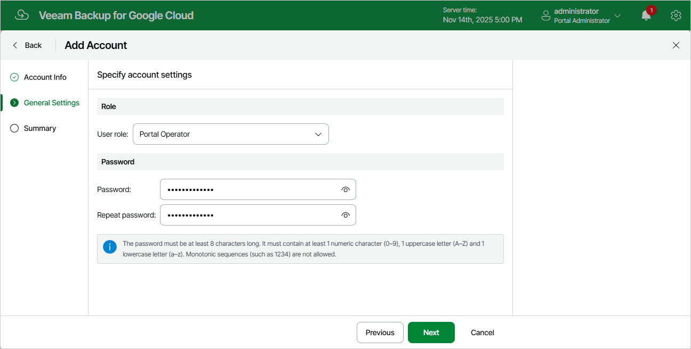

In this article

At the General Settings step of the wizard, choose a role for the user account and specify a password that the user will use to access Veeam Backup for Google Cloud.

Page updated 11/14/2025

Page content applies to build 7.0.0.47
