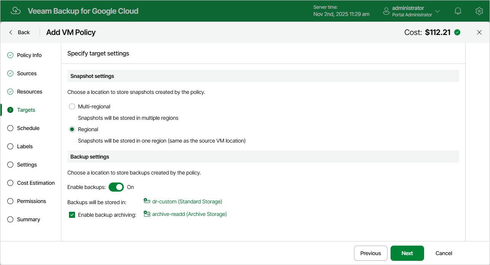
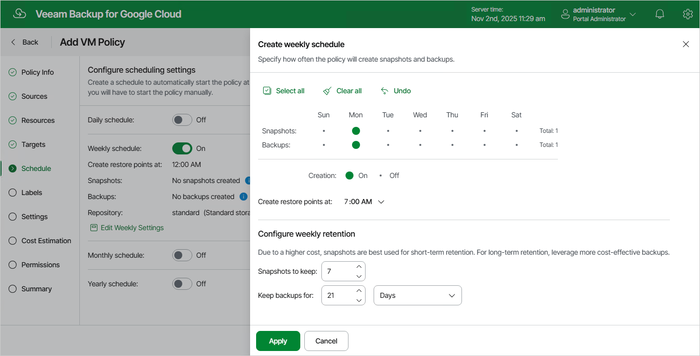
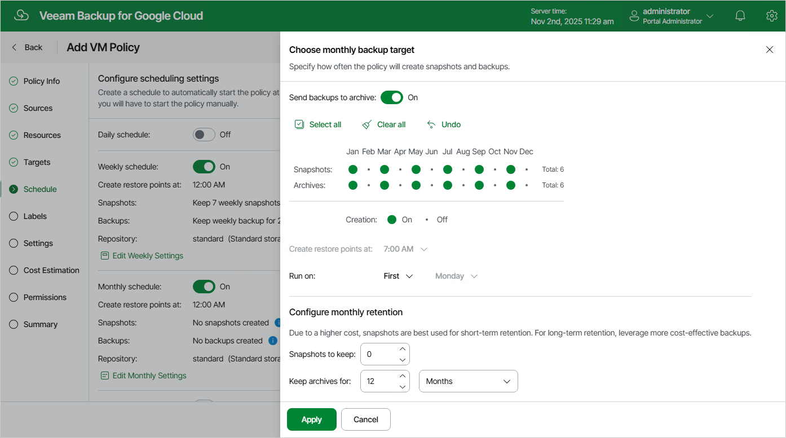
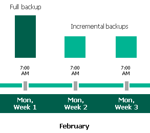
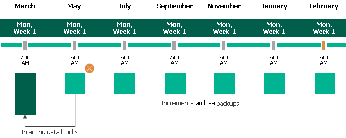

# Enabling Backup Archiving

When you combine multiple types of schedules, you can enable the archiving mechanism to instruct Veeam Backup for Google Cloud to store backed-up data in the low-cost, long-term Google Cloud archival storage. The mechanism is the most useful in the following cases:

* Your data retention policy requires that you keep rarely accessed data in an archive.
* You want to reduce data-at-rest costs and to save space in the high-cost, short-term Google Cloud standard storage.

With backup archiving, Veeam Backup for Google Cloud can retain backups created according to a daily, weekly or monthly schedule for longer periods of time:

* To enable monthly archiving, you must configure a daily or a weekly backup schedule (or both).
* To enable yearly archiving, you must configure a daily, a weekly or a monthly backup schedule (or all three).

For Veeam Backup for Google Cloud to use the archiving mechanism, there must be specified at least 2 different schedules: one schedule will control the regular creation of backups, while another schedule will control the process of copying backups to an archive repository. Backup chains created according to these two schedules will be completely different — for more information, see [Backup Chain](backup_chain_vm.md) and [Archive Backup Chain](archive_backup_chain_vm.md).

Consider the following example. You want a backup policy to create image-level backups of your critical workloads once a week, to keep the backed-up data in a standard repository for 3 weeks, and also to keep backups created once in 2 months in an archive repository for a year. In this case, you create 2 schedules when configuring the backup policy settings — weekly and monthly:

1. In the policy target settings, you set the Enable backups toggle to On, select a standard repository that will store regular backups, and select an archive repository that will store archived data.

1. In the weekly scheduling settings, you select hours and days when backups will be created (for example, 7:00 AM, Monday), and specify a number of days for which Veeam Backup for Google Cloud will retain backups (for example, 21 days).

Veeam Backup for Google Cloud will propagate these settings to the archive schedule (which is the monthly schedule in our example).

1. In the monthly scheduling settings, you enable the archiving mechanism by setting the Send backups to archive toggle to On, specify when Veeam Backup for Google Cloud will create archive backups, and choose for how long you want to keep the created backups in the archive repository.

For example, January, March, May, July, September, November, 12 months and First Monday.

|  |
| --- |
| Important |
| * When you enable backup archiving, you become no longer able to create a schedule of the same frequency for regular backups. By design, these two functionalities are mutually exclusive. * If you enable backup archiving, it is recommended that you set the Snapshots to keep value to 0, to reduce unexpected snapshot charges. * If you enable backup archiving, it is recommended that you set the Keep archives for value to at least 12 months (or 365 days), since the minimum storage duration of the Google Cloud archival storage is 365 days. * If you select the On day option, [harmonized scheduling](harmonized_scheduling.md) cannot be guaranteed. Plus, to support the On day option, Veeam Backup for Google Cloud will require to create an additional temporary restore point if there are no other schedules planned to run on that day. However, the temporary restore point will be removed by the Backup Retention process from Google Cloud Storage during approximately 24 hours, to reduce unexpected infrastructure charges. |

According to the specified scheduling settings, Veeam Backup for Google Cloud will create image-level backups in the following way:

1. On the first Monday of February, a backup session will start at 7:00 AM to create the first restore point in the regular backup chain. Veeam Backup for Google Cloud will store this restore point as a full backup in the standard repository.
2. On the second and third Mondays of February, Veeam Backup for Google Cloud will create restore points at 7:00 AM and add them to the regular backup chain as incremental backups in the standard repository.

1. On the fourth Monday of February, Veeam Backup for Google Cloud will create a new restore point at 7:00 AM. By the moment the backup session completes, the earliest restore point in the regular backup chain will get older than the specified retention limit. That is why Veeam Backup for Google Cloud will rebuild the full backup and remove from the chain the restore point created on the first Monday.

For more information on how Veeam Backup for Google Cloud transforms regular backup chains, see [Retention Policy for Backups](backup_retention_vm.md).

1. On the first Monday of March, a backup session will start at 7:00 AM to create another restore point in the regular backup chain. At the same time, the earliest restore point in the regular backup chain will get older than the specified retention limit again. That is why Veeam Backup for Google Cloud will rebuild the full backup again and remove from the chain the restore point created on the second Monday.

After the backup session completes, an archive session will create a restore point with all the data from the regular backup chain. Veeam Backup for Google Cloud will copy this restore point as a full archive backup to the archive repository.

1. Up to May, Veeam Backup for Google Cloud will continue adding new restore points to the regular backup chain and deleting outdated backups from the standard repository, according to the specified weekly scheduling settings.

On the first Monday of May, an archive session will create a restore point with only that data that has changed since the previous archive session in March. Veeam Backup for Google Cloud will copy this restore point as an incremental archive backup to the archive repository.

1. Up to the first Monday of March of the next year, Veeam Backup for Google Cloud will continue adding new restore points to the regular backup chain and deleting outdated backups from the standard repository, according to the specified weekly scheduling settings. Veeam Backup for Google Cloud will also continue adding new restore points to the archive backup chain, according to the specified monthly settings.

By the moment the archive session completes, the earliest restore point in the archive backup chain will get older than the specified retention limit. That is why Veeam Backup for Google Cloud will rebuild the full archive backup and remove from the chain the restore point created on the first Monday of March of the previous year.

For more information on how Veeam Backup for Google Cloud transforms archive backup chains, see [Retention Policy for Archived Backups](archive_backup_retention_vm.md).

