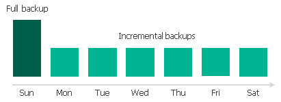

In this article

If you enable image-level backups for a backup policy, Veeam Backup for Google Cloud creates a new backup in a standard or nearline repository during every backup session. A sequence of backups created during a set of backup sessions makes up a regular backup chain.

The regular backup chain includes backups of the following types:

* Full — a full backup stores a copy of the full instance image.
* Incremental — incremental backups store incremental changes of the instance image.

To create a regular backup chain for a VM instance protected by a backup policy, Veeam Backup for Google Cloud implements the forever forward incremental backup method:

1. During the first backup session, Veeam Backup for Google Cloud copies the full instance image and creates a full backup in the standard or nearline repository. The full backup becomes a starting point in the regular backup chain.
2. During subsequent backup sessions, Veeam Backup for Google Cloud copies only those data blocks that have changed since the previous backup session, and stores these data blocks to incremental backups in the standard or nearline repository. The content of each incremental backup depends on the content of the full backup and the preceding incremental backups in the regular backup chain.

Veeam Backup for Google Cloud creates incremental backups based on the Veeam proprietary filtering mechanism that filters out unchanged data blocks by calculating a checksum for every block. The Google Cloud changed block tracking (CBT) mechanism that would allow tracking changed blocks of data and would increase the efficiency of incremental backups is not implemented at the moment.

Full and incremental backups act as restore points for backed-up instances that let you roll back instance data to the necessary state. To recover an instance to a specific point in time, the chain of backups created for the instance must contain a full backup and a set of incremental backups dependent on the full backup.

If some backup in the regular backup chain is missing, you will not be able to roll back to the necessary state. For this reason, you must not delete individual backups from the backup repository manually. Instead, you must specify retention policy settings that will let you maintain the necessary number of backups in the repository. For more information, see [VM Backup Retention](backup_retention_vm.md).

Related Topics

* [Archive Backup Chain](archive_backup_chain_vm.md)
* [VM Backup Retention](backup_retention_vm.md)

Page updated 11/8/2023

Page content applies to build 7.0.0.47
