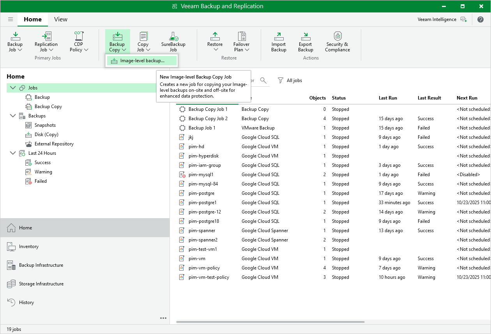

In this article

Backup copy is a technology that helps you copy and store backed-up data of VM instances in different locations. Storing data in different locations increases its availability and ensures that data can be recovered in case a disaster strikes.

Backup copy is a job-driven process. Veeam Backup & Replication fully automates the backup copy process and lets you specify retention settings to maintain the desired number of restore points, as well as full backups for archival purposes. For more information on the backup copy functionality, see the Veeam Backup & Replication User Guide, section [Backup Copy](https://helpcenter.veeam.com/docs/vbr/userguide/backup_copy.html?ver=13).

|  |
| --- |
| Important |
| Backup copy can be performed only using backup files stored in backup repositories for which you have specified HMAC keys associated with the service accounts that are used to access the repositories. To learn how to specify credentials for repositories, see sections [Creating New Repositories](add_standard_repository.md) and [Connecting to Existing Repositories](connect_existing_repository.md). |

To create a backup copy job, do the following:

1. In the Veeam Backup & Replication console, open the Home view.
2. Click Backup Copy on the ribbon.
3. Complete the New Backup Copy Job wizard as described in the Veeam Backup & Replication User Guide, section [Creating Backup Copy Jobs for VMs and Physical Machines](https://helpcenter.veeam.com/docs/vbr/userguide/backup_copy_create.html?ver=13).

Page updated 11/18/2025

Page content applies to build 7.0.0.47
