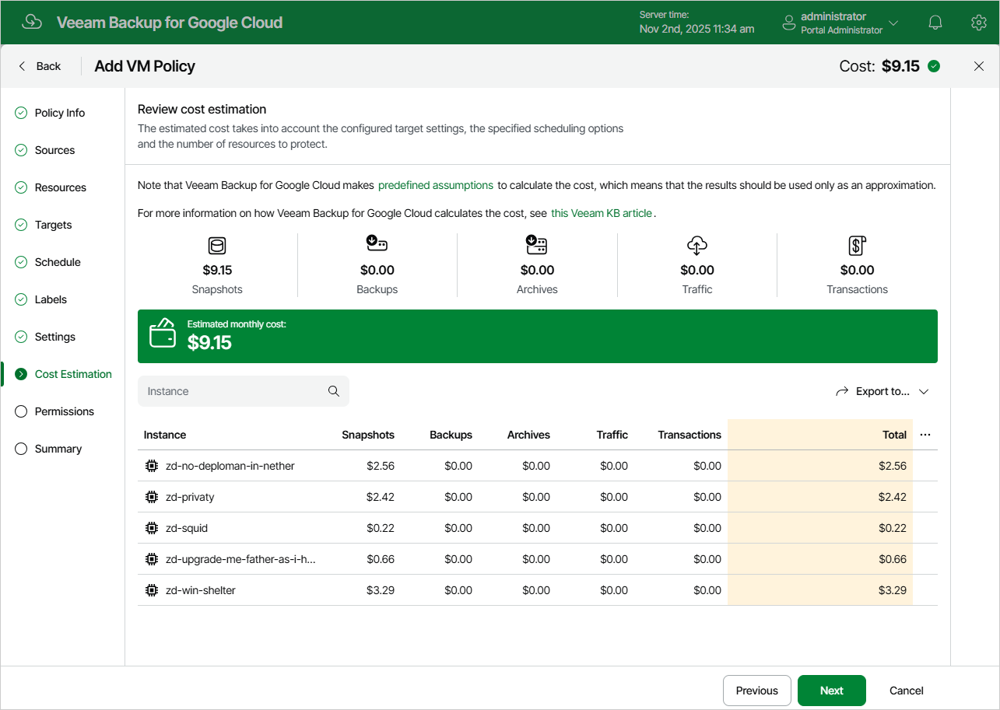

# Step 9. Review Estimated Cost

[This step applies only if you have created a schedule for the backup policy at the Schedule step of the wizard]

At the Cost Estimation step of the wizard, review the approximate monthly cost of Google Cloud services that Veeam Backup for Google Cloud will require to protect the VM instances added to the backup policy. The total estimated cost includes the following:

* The cost of creating and maintaining cloud-native snapshots of the VM instances.

For each VM instance included in the backup policy, Veeam Backup for Google Cloud takes into account the total size and the number of persistent disks attached, the number of restore points to be kept in the snapshot chain, and the configured scheduling settings.

* The cost of creating and storing in backup repositories image-level backups of the VM instances.

For each VM instance included in the backup policy, Veeam Backup for Google Cloud takes into account the total size and the number of persistent disks attached, the period of time during which restore points will be kept in the backup chain, and the configured scheduling and health check settings.

* The cost of creating and storing in backup repositories archived backups of the VM instances.

For each VM instance included in the backup policy, Veeam Backup for Google Cloud takes into account the total size and the number of persistent disks attached, the period of time during which restore points will be kept in the archive backup chain, and the configured scheduling settings.

* The cost of transferring the VM instance data between Google Cloud regions during data protection operations (for example, if a protected VM instance and the target storage bucket reside in different regions).
* The cost of sending API requests to Google Cloud during data protection operations.
* The cost of deploying worker instances for backup operations.

The estimated cost may occur to be significantly higher due to the backup frequency, cross-region data transfer and snapshot charges. To reduce the cost, you can try the following workarounds:

* To avoid additional costs related to cross-region data transfer, either select a backup repository that resides in the same region as VM instances that you plan to back up, or select an archive repository that resides in the same region as the nearline or standard repository used to store regular backups.

* To reduce high snapshot charges, adjust the snapshot retention settings to keep less restore points in the snapshot chain.
* To optimize the cost of storing backups, modify the scheduling settings to run the backup policy less frequently, or specify an archive repository for long-term retention of restore points.

|  |
| --- |
| Tip |
| You can save the cost estimation as a .CSV or .XML file. To do that, click Export to and select the necessary format. |

