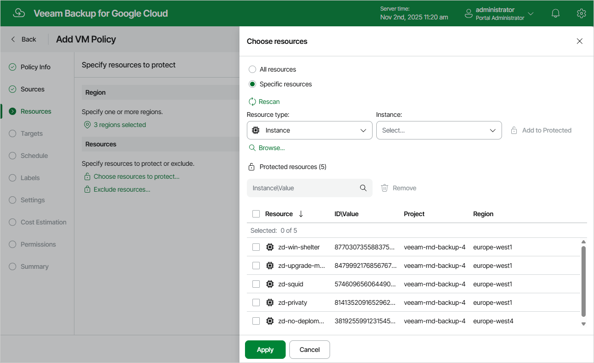

# Step 4b. Select VM Instances

In the Resources section of the Resources step of the wizard, specify the backup scope — select VM instances that Veeam Backup for Google Cloud will back up:

1. Click Choose resources to protect.
2. In the Choose resources window, choose whether you want to back up all VM instances from the regions selected at [step 4a](backup_policy_regions.md), or only specific VM instances.

If you select the All resources option, Veeam Backup for Google Cloud will regularly check for new VM instances launched in the selected regions and automatically update the backup policy settings to include these instances in the backup scope.

If you select the Specific resources option, you must also specify the instances explicitly:

1. Use the Resource type drop-down list to choose whether you want to add individual VM instances or Google Cloud labels to the backup scope.

If you select the Label option, Veeam Backup for Google Cloud will back up only those VM instances that reside in the selected regions under specific labels.

1. Use the Instance\Label list to find the necessary resource, and then click Add to Protected to add the resource to the backup scope.

For a resource to be displayed in the list of available resources, it must reside in a region that has ever been specified in any backup policy. Otherwise, the only option to discover available resources is to click Browse and wait for Veeam Backup for Google Cloud to populate the resource list.

|  |
| --- |
| Tip |
| You can simultaneously add multiple resources to the backup scope. To do that, click Browse, select check boxes next to the necessary VM instances or labels in the list of available resources, and then click Protect.  If the list does not show the resources that you want to back up, click Rescan to launch the data collection process. As soon as the process is over, Veeam Backup for Google Cloud will update the resource list. |

If you add a label to the backup scope, Veeam Backup for Google Cloud will regularly check for new VM instances assigned the added label and automatically update the backup policy settings to include these instances in the scope. However, this applies only to VM instances from the regions selected at [step 4a](backup_policy_regions.md). If you select a label assigned to VM instances from other regions, these instances will not be protected by the backup policy. To work around the issue, either go back to step 4a and add the missing regions, or create a new backup policy.

1. To save changes made to the backup policy settings, click Apply.

|  |
| --- |
| Tip |
| As an alternative to selecting the Specific resources option and specifying the resources explicitly, you can select the All resources option and exclude a number of resources from the backup scope. To do that, click Exclude resources and specify the VM instances or labels that you do not want to back up — the procedure is the same as described for including resources in the backup scope.  Consider that if a resource appears both in the list of included and excluded resources, Veeam Backup for Google Cloud will still not process the resource because the list of excluded resources has a higher priority. |

