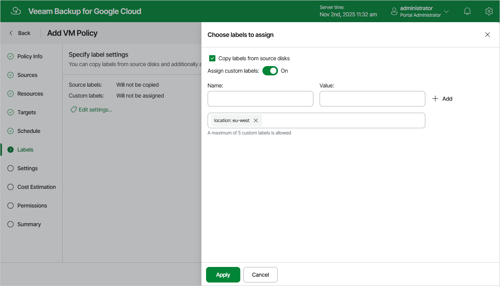

# Step 7. Enable Label Assignment

At the Labels step, you can instruct Veeam Backup for Google Cloud to assign labels to cloud-native snapshots created by the backup policy:

1. Click the Edit settings link.
2. In the Choose labels to assign window, choose whether you want to assign to snapshots of the selected VM instances already existing labels from source persistent disks and your own custom labels.

If you set the Assign custom labels toggle to On, you must also specify the labels explicitly. To do that, use the Name and Value fields to specify a name and a value for the new custom label, and then click Add. Note that you cannot add more than 5 custom labels.

1. To save changes made to the label settings, click Apply.

