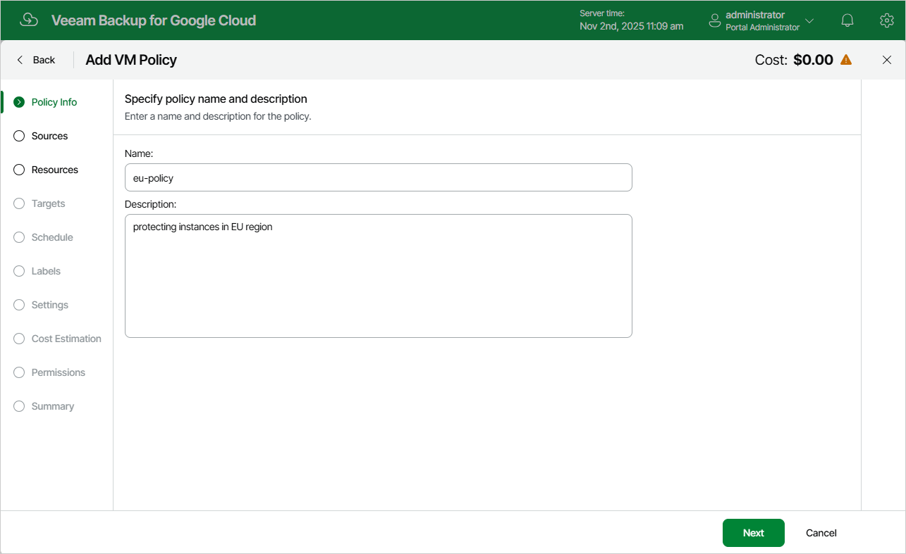

# Step 2. Specify Backup Policy Name and Description

At the Policy Info step of the wizard, enter a name for the new backup policy and provide a description for future reference. The policy name can contain only uppercase Latin letters, lowercase Latin letters, numeric characters and hyphens; the maximum length of the name is 127 characters.

|  |
| --- |
| Note |
| You can tell snapshots created by Veeam Backup for Google Cloud from other snapshots in your infrastructure by their names — the name of every snapshot created by a backup policy will contain the word veeam, a GUID and the ordinary number of the processed persistent disk: veeam-{GUID}-{disk number}. |

