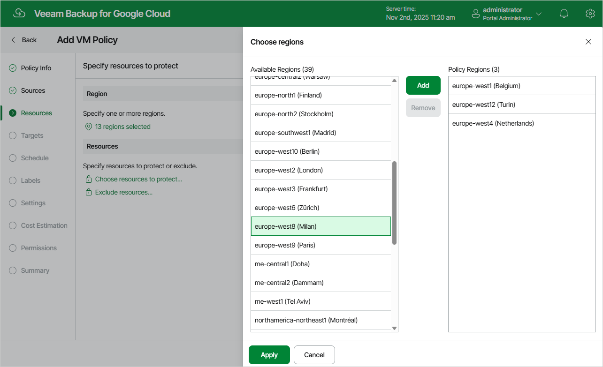

In this article

In the Region section of the Resources step of the wizard, choose regions in which VM instances that you want to protect reside.

1. Click Choose regions.
2. In the Choose regions window, select the necessary regions, click Add to include them in the backup policy, and then click Apply.

Page updated 11/11/2025

Page content applies to build 7.0.0.47
