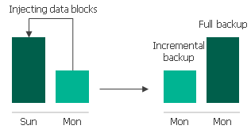
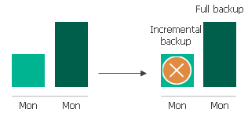
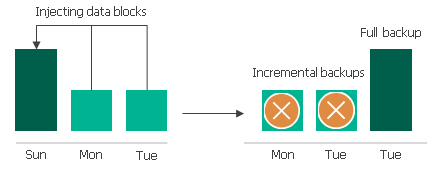

# VM Backup Retention

For image-level backups, Veeam Backup for Google Cloud retains restore points for the number of days defined in backup scheduling settings as described in section [Creating VM Policies](backup_policy_schedule.md)[.](backup_policy_schedule.md)

To track and remove outdated restore points from a regular backup chain, Veeam Backup for Google Cloud performs the following actions once a day:

1. Veeam Backup for Google Cloud checks the configuration database to detect standard and nearline repositories that contain outdated restore points.
2. If an outdated restore point exists in a backup repository, Veeam Backup for Google Cloud deploys a worker instance in a Google Cloud region in which the repository with backed-up data resides.
3. Veeam Backup for Google Cloud transforms the regular backup chain in the following way:

1. Rebuilds the full backup to include there data of the incremental backup that follows the full backup. To do that, Veeam Backup for Google Cloud injects into the full backup data blocks from the earliest incremental backup in the chain. This way, the full backup ‘moves’ forward in the regular backup chain.

1. Removes the earliest incremental backup from the chain as redundant — this data has already been injected into the full backup.

1. Veeam Backup for Google Cloud repeats step 2 for all other outdated restore points found in the regular backup chain until all the restore points are removed. As data from multiple restore points is injected into the rebuilt full backup, Veeam Backup for Google Cloud ensures that the regular backup chain is not broken and that you will be able to recover your data when needed.

1. Veeam Backup for Google Cloud removes the worker instance when the retention session completes.

|  |
| --- |
| Note |
| Each worker instance can process only one retention task at a time, and Veeam Backup for Google Cloud can simultaneously deploy maximum 10 worker instances to process retention tasks. If the number of retention tasks that must be processed by worker instances is more than the specified limit, the tasks exceeding this limit are queued. |

Related Topics

[Retention Policy for Archived Backups](archive_backup_retention_vm.md)

