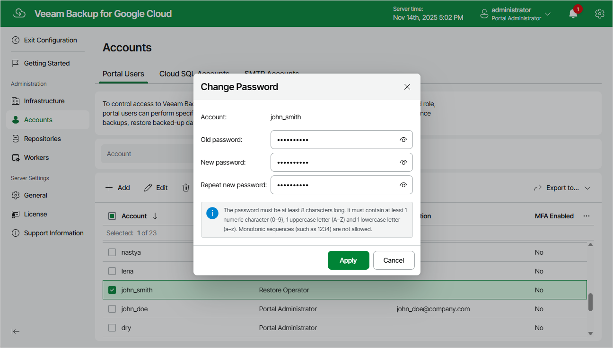

In this article

For each user account, you can change the password specified while adding the account:

1. Switch to the Configuration page.
2. Navigate to Accounts > Portal Users.
3. Select the account and click Change Password.
4. In the Change Password window, enter the currently used password, enter and confirm a new password, and then click Apply.

Page updated 11/14/2025

Page content applies to build 7.0.0.47
