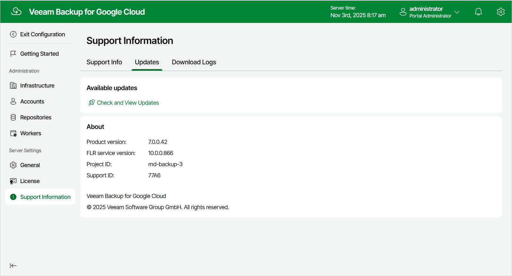
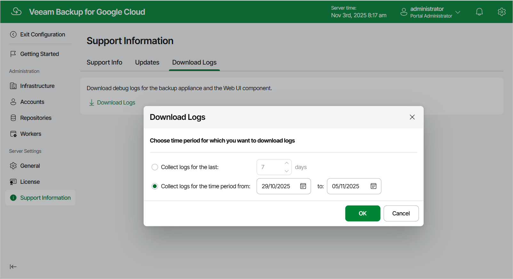
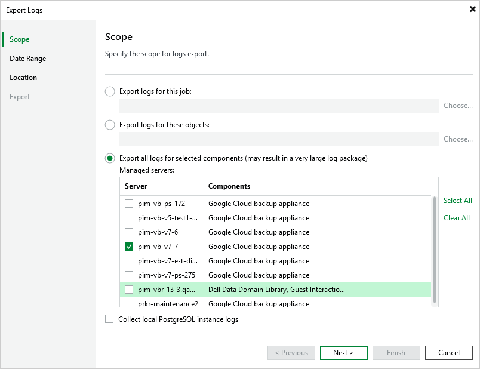

In this article

If you have any questions or issues with Veeam Backup for Google Cloud, you can search for a resolution on [Veeam R&D Forums](https://forums.veeam.com/) or submit a support case in the [Veeam Customer Support Portal](https://www.veeam.com/support.html).

When you submit a support case, it is recommended that you provide the Veeam Customer Support Team with the following information:

* [Version information for the product and its components](#details)
* The error message or an accurate description of the problem you are facing
* [Log files](#logs)

Viewing Product Details Using Web UI

To view the product details, do the following:

1. Switch to the Configuration page.
2. Navigate to Support Information > Updates.

The About section of the Updates tab displays the following information:

* Product version — the currently installed version of Veeam Backup for Google Cloud.
* Project ID — the unique identification number of the Google Cloud project to which the VM instance running Veeam Backup for Google Cloud belongs.
* Support ID — the unique identification number of the Veeam support contract.
* FLR service version — the version of the File-Level Recovery Service currently running on the backup appliance.

|  |
| --- |
| Tip |
| You can click the link in the Available Updates section of the Updates tab to check for, download and install new product versions and available package updates. For more information, see [Updating Veeam Backup for Google Cloud](updating_vb.md). |

Downloading Product Logs Using Web UI

To download the product logs, do the following:

1. Switch to the Download Logs tab.
2. Click Download Logs.
3. In the Download Logs window, specify a time interval for which the logs will be collected:

* Select the Collect logs for the last option if you want to collect data for a specific number of days in the past.
* Select the Collect logs for the time period from option if you want to collect data for a specific period of time in the past.

After you click OK, the logs will be saved locally in the default download folder as a single .ZIP archive.

Downloading Product Logs Using Console

To export the product logs, do the following:

1. In the Veeam Backup & Replication console, open the main menu and navigate to Help > Support Information.
2. In the Export Logs wizard, do the following:

1. At the Scope step, select the Export all logs for selected components option. Then, in the Managed servers list, select the backup server, backup appliances and other components for which you want to export logs.
2. Complete the wizard as described in the Veeam Backup & Replication User Guide, section [Export Logs](https://helpcenter.veeam.com/docs/vbr/userguide/exporting_logs.html?ver=13).

Page updated 11/18/2025

Page content applies to build 7.0.0.47
