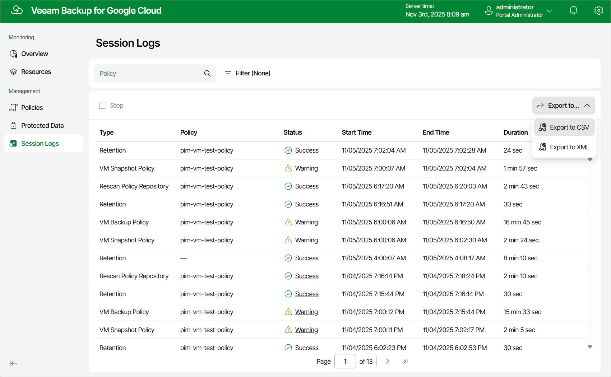

In this article

You can export properties of objects managed by Veeam Backup for Google Cloud as a single .CSV or .XML file. To do that, navigate to the necessary tab and click Export. Veeam Backup for Google Cloud will save the file with the exported data to the default download directory on the local machine.

|  |
| --- |
| Note |
| Even if you try to export properties of a specific object, Veeam Backup for Google Cloud will still export all properties of all objects present on the currently opened tab. |

Page updated 11/5/2025

Page content applies to build 7.0.0.47
