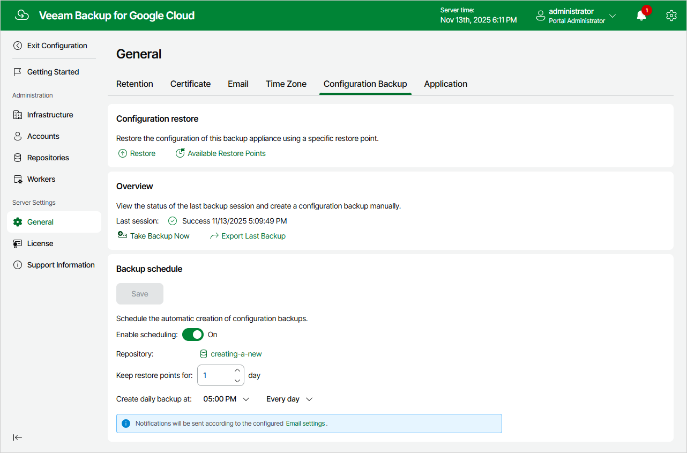

In this article

To launch the Configuration Restore wizard, do the following:

1. Switch to the Configuration page.
2. Navigate to General > Configuration Backup.
3. In the Configuration restore section, click Restore.

Page updated 11/14/2025

Page content applies to build 7.0.0.47
