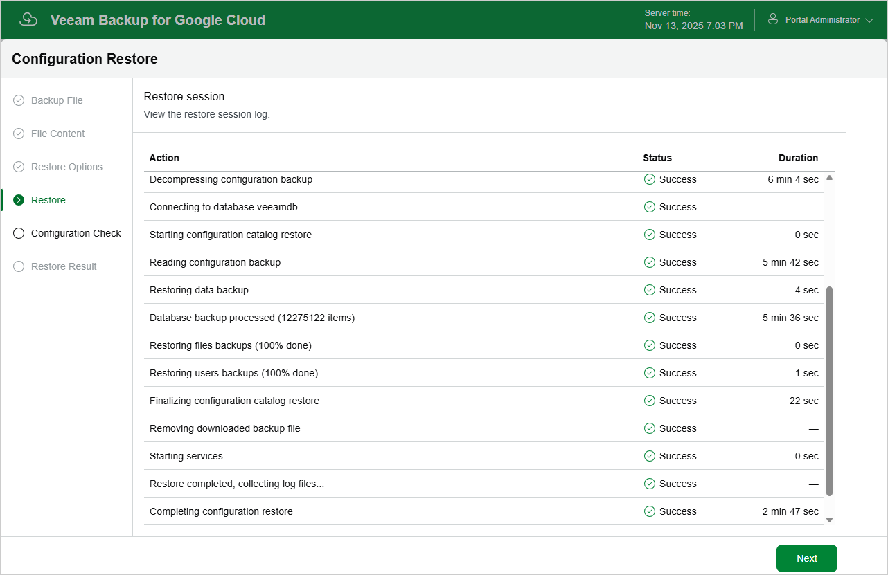

In this article

Veeam Backup for Google Cloud will display the results of every step performed while executing the configuration restore. At the Restore step of the wizard, wait for the restore process to complete and click Next.

Page updated 11/14/2025

Page content applies to build 7.0.0.47
