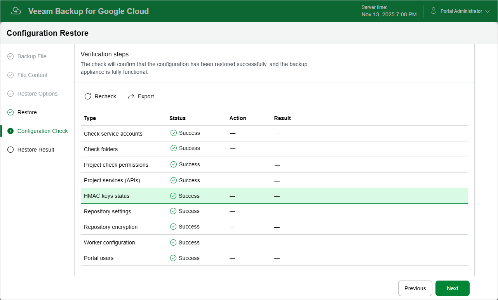

In this article

After the restore process is over, Veeam Backup for Google Cloud will run a number of verification checks to confirm that the configuration data has been restored successfully. At the Configuration Check step of the wizard, wait for the verification checks to complete and click Next.

If Veeam Backup for Google Cloud encounters an issue while performing a verification check, the Result column will display a description of the issue. Note that some issues are displayed for informational purposes only and do not require any action at this point. If any actions are required, the Action column will provide instructions on how to resolve the issue. For example, to resolve the issue with service account permissions, click View in the Project check permissions field, and then use the Project checks window to grant missing permissions to every service account associated with a specific project.

You can grant the missing permissions to the service account [using the Google Cloud console](https://cloud.google.com/iam/docs/granting-changing-revoking-access) or instruct Veeam Backup for Google Cloud to do it:

* To grant the missing permissions manually, click Download Script. Veeam Backup for Google Cloud will generate a gcloud script that you can run in the Google Cloud console to assign all the necessary permissions to the service account.

The account under which you run the script must have the permissions required both to get and set project IAM policies and to create custom IAM roles (for example, it can have the iam.securityAdmin and iam.roleAdmin roles assigned). To learn what permissions and roles are required to create custom roles in IAM, see [Google Cloud documentation](https://cloud.google.com/iam/docs/understanding-custom-roles).

* To let Veeam Backup for Google Cloud grant the missing permissions automatically, click Grant and then click Sign in with Google in the Grant permissions window. You will be redirected to the OAuth consent screen authorization page. Sign in using credentials of a Google account that will be used to grant the permissions.

The account under which you sign in to Google Cloud must have the permissions required both to get and set project IAM policies and to create custom IAM roles (for example, it can have the iam.securityAdmin and iam.roleAdmin roles assigned). To learn what permissions and roles are required to create service account, see [Google Cloud documentation](https://cloud.google.com/iam/docs/understanding-custom-roles).

|  |
| --- |
| Note |
| For Veeam Backup for Google Cloud to be able to authorize in Google Cloud, the OAuth consent screen must be configured as described in section [Registering Applications](registering_applications.md). Note that Veeam Backup for Google Cloud does not store in the configuration database the provided Google account credentials and access tokens received during authorization. |

To make sure that the missing permissions have been successfully granted, click Recheck.

Page updated 11/14/2025

Page content applies to build 7.0.0.47
