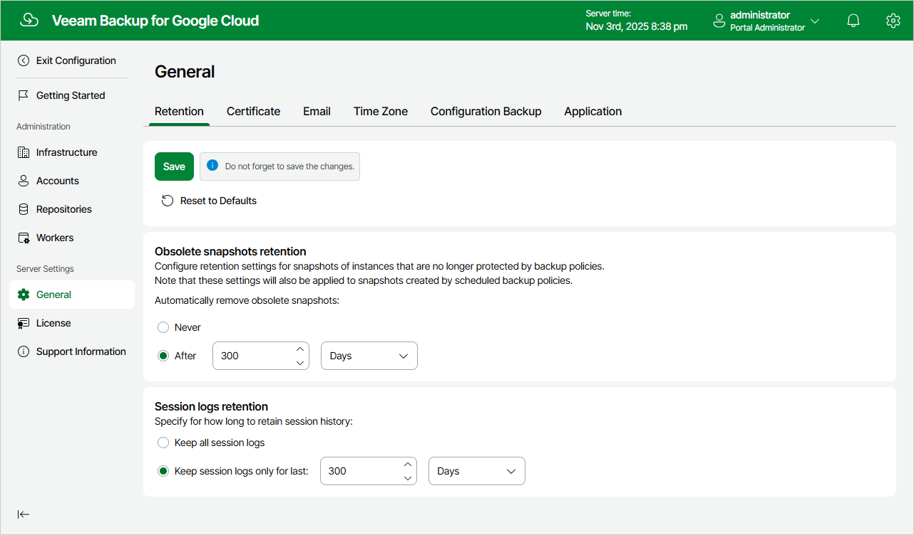

In this article

You can configure global retention settings to specify for how long the following data will be retained in the configuration database:

* [Obsolete snapshots](#snapshots)
* [Session records](#sessions)

Configuring Retention Settings for Obsolete Snapshots

If an instance (whether it is a VM instance, a Cloud SQL instance or a Cloud Spanner instance) is no longer processed by a backup policy (for example, it was removed from the backup policy or the backup policy no longer exists), its cloud-native snapshots become obsolete. These snapshots are removed from the configuration database according to their own retention settings.

|  |
| --- |
| Note |
| Global retention settings apply to all cloud-native snapshots created by the Veeam backup service. If an instance is still processed by a backup policy, but some of its cloud-native snapshots are older than the number of days (or months) specified in the global retention settings, these cloud-native snapshots will be removed from the configuration database. |

To configure retention settings for obsolete snapshots, do the following:

1. Switch to the Configuration page.
2. Navigate to General > Retention.
3. In the Obsolete snapshots retention section, select either of the following options:

* Select the Never option if you do not want Veeam Backup for Google Cloud to remove obsolete snapshots.

* Select the After option if you want to specify the number of days (or months) during which Veeam Backup for Google Cloud will keep obsolete snapshots in the configuration database. The number must be between 15 and 36135 for days, and between 1 and 1188 for months.

If you select this option, Veeam Backup for Google Cloud will remove obsolete instance snapshots from the configuration database as soon as the specified period of time is over — even if the instances are still processed by backup policies.

1. Click Save.

|  |
| --- |
| Note |
| When Veeam Backup for Google Cloud removes an obsolete snapshot from the configuration database, it also removes the snapshot from Google Cloud Storage. |

Configuring Retention Settings for Session Records

Veeam Backup for Google Cloud stores records for all sessions of performed data protection and disaster recovery operations in the configuration database on the additional data disk attached to the backup appliance. These session records are removed from the configuration database according to their own retention settings.

To configure retention settings for session records, do the following:

1. In the Session logs retention section, select either of the following options:

* Select the Keep all session logs option if you do not want Veeam Backup for Google Cloud to remove session records.

* Select the Keep session logs only for last option if you want to specify the number of days (or months) during which Veeam Backup for Google Cloud will keep session records in the configuration database.

If you select this option, Veeam Backup for Google Cloud will remove all session records that are older than the specified time limit.

1. Click Save.

|  |
| --- |
| Important |
| Retaining all session records in the configuration database may overload the data disk. By default, the disk comes with 20 GB of storage capacity. If you choose not to remove sessions records at all, consider increasing the disk space to avoid runtime problems. |

Page updated 11/12/2025

Page content applies to build 7.0.0.47
