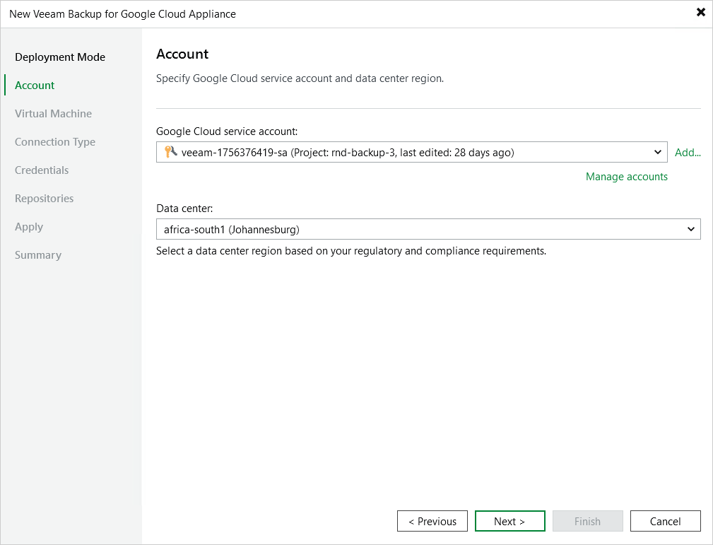

# Step 3. Specify Service Account Settings

At the Account step of the wizard, do the following:

1. From the Google Cloud service account drop-down list, select a service account whose permissions will be used to connect the backup appliance.

For a service account to be displayed in the Google Cloud service account drop-down list, it must be created in Google Cloud and added to the Cloud Credentials Manager as described in the Veeam Backup & Replication User Guide, section [Google Cloud Service Accounts](https://helpcenter.veeam.com/docs/vbr/userguide/cloud_credentials_gcp.html?ver=13). If you have not added the necessary service account to the Cloud Credentials Manager beforehand, you can do it without closing the wizard. To do that, click either the Manage accounts link or the Add button, and complete the Google Cloud Service Account wizard.

|  |
| --- |
| Note |
| When you create a service account using the Veeam Backup & Replication console, the service account is automatically assigned the Owner IAM role with a wide scope of permissions and capabilities. If you want the service account to be assigned a limited list of permissions, create a service account manually in Google Cloud beforehand and then add it to the Cloud Credentials Manager. For more information on required permissions that must be assigned to the service account, see [Plug-In Permissions](plugin_permissions.md). |

1. From the Data center drop-down list, select the Google Cloud region in which the backup appliance resides.

For more information on regions and zones in Google Cloud, see [Google Cloud documentation](https://cloud.google.com/compute/docs/regions-zones).

