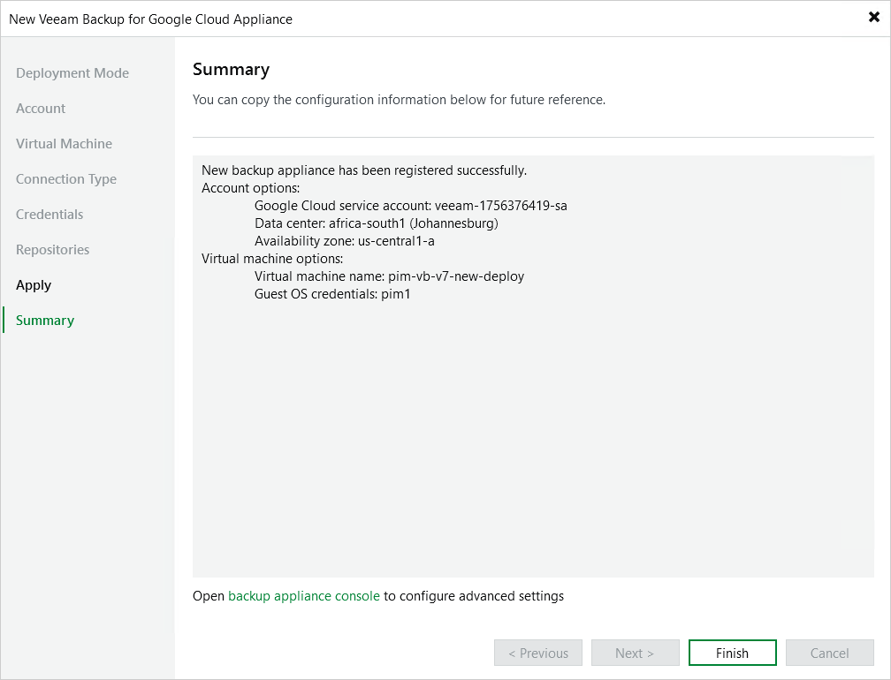

In this article

At the Summary step of the wizard, review summary information and click Finish. After the backup appliance is added to the backup infrastructure, you will be able configure its settings in the Veeam Backup for Google Cloud Web UI.

If you want Veeam Backup & Replication to open the Web UI of the added appliance immediately, click the backup appliance console link.

Page updated 11/5/2025

Page content applies to build 7.0.0.47
