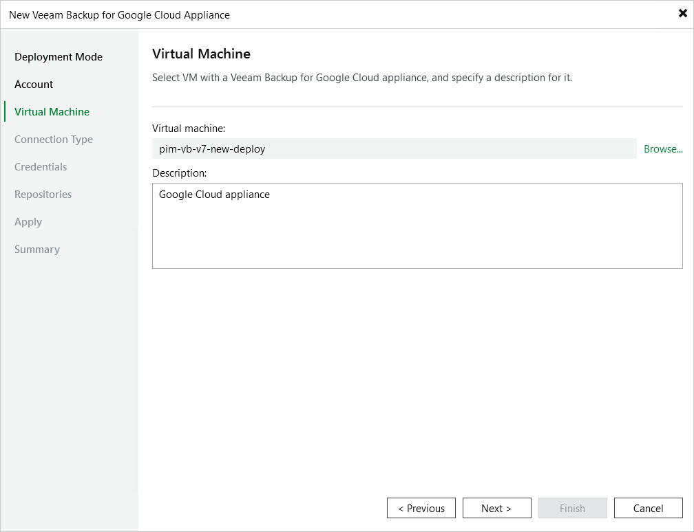

# Step 4. Select Appliance

At the Virtual Machine step of the wizard, select the backup appliance that you want to add to the backup infrastructure:

1. Click Browse.
2. In the Select Virtual Machine window, select the necessary appliance and click OK.
3. In the Description field, specify a description for future reference.

