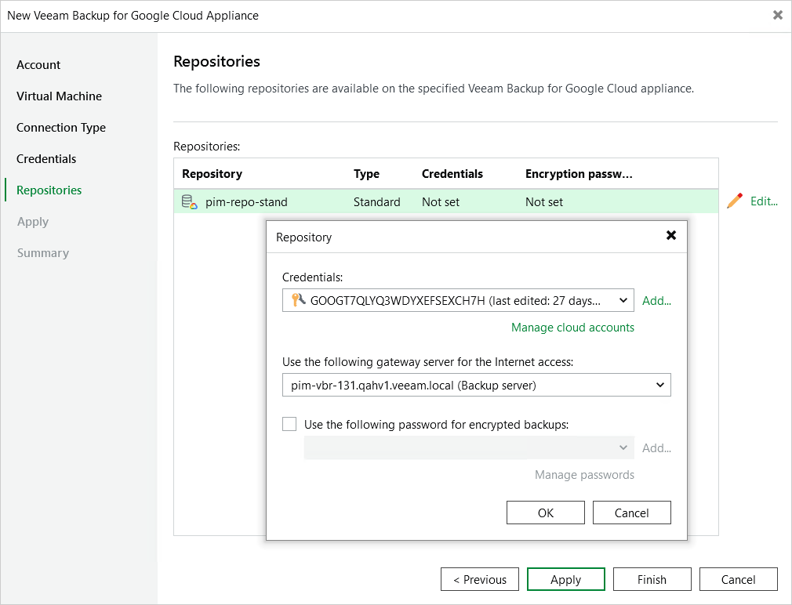

In this article

At the Repositories step of the wizard, a list of all standard and archive repositories already configured on the selected backup appliance will be displayed. After you complete the wizard, Veeam Backup & Replication will automatically add these repositories to the backup infrastructure.

You will be able to use the Veeam Backup & Replication console to perform [entire VM instance restore](performing_instance_restore_console.md), [entire SQL instance restore](performing_sql_instance_restore_console.md) and [entire Spanner instance restore](spanner_restore_console.md) only — unless you specify the following configuration settings for each repository whose restore points you want to use to recover backed-up data:

|  |
| --- |
| Note |
| The following procedure applies only to repositories of the Standard and Nearline storage classes. For repositories of the Archive storage class, there is no possibility to specify any configuration settings. |

1. In the Repositories list, select the necessary standard repository and click Edit.
2. In the Repository window:

1. From the Credentials drop-down list, select a Hash-based Message Authentication Code (HMAC) key associated with the service account that will be used to access the repository.

For an HMAC key to be displayed in the Credentials list, it must be added to the Cloud Credentials Manager as described in the Veeam Backup & Replication User Guide, section [Google Cloud Accounts](https://helpcenter.veeam.com/docs/vbr/userguide/cloud_credentials_google.html?ver=13). If you have not added the necessary key to the Cloud Credentials Manager beforehand, you can do it without closing the Repository window. To do that, click either the Manage accounts link or the Add button, and specify the HMAC key access ID and secret in the Credentials window.

1. From the Use the following gateway server for the Internet access drop-down list, select a gateway server that will be used to provide access to the repository.

For a gateway server to be displayed in the Use the following gateway server for the Internet access drop-down list, it must be added to the backup infrastructure. For more information on gateway servers, see [Architecture Overview](architecture_overview.md).

1. If encryption is enabled for the repository, select the Use the following password for encrypted backups check box. From the drop-down list, select the password that is used to encrypt data. Veeam Backup & Replication will use the specified password to decrypt backup files stored in this repository.

For a password to be displayed in the Use the following password for encrypted backups drop-down list, it must be added to the backup infrastructure as described in the Veeam Backup & Replication User Guide, section [Creating Passwords](https://helpcenter.veeam.com/docs/vbr/userguide/password_manager_create.html?ver=13). If you have not added the necessary password beforehand, you can do it without closing the Repository window. To do that, click either the Manage passwords link or the Add button, and specify the password and hint in the Password window.

If you do not specify a password for a standard repository with encryption enabled, you will have to decrypt data stored in this repository manually as described in section [Decrypting Backups](managing_data_console.md#decrypt).

After you finish working with the wizard, all the repositories will be displayed in the Backup Infrastructure view under the External Repositories node.

|  |
| --- |
| Note |
| If some of the repositories are already added to the backup infrastructure of another backup server, you will be prompted to claim the ownership of these repositories. To learn how to claim the ownership, see the Veeam Backup & Replication User Guide, section [Ownership](https://helpcenter.veeam.com/docs/vbr/userguide/external_repository_ownership.html?ver=13). |

Related Topics

[Managing Backed-Up Data](managing_data_console.md)

Page updated 12/2/2025

Page content applies to build 7.0.0.47
