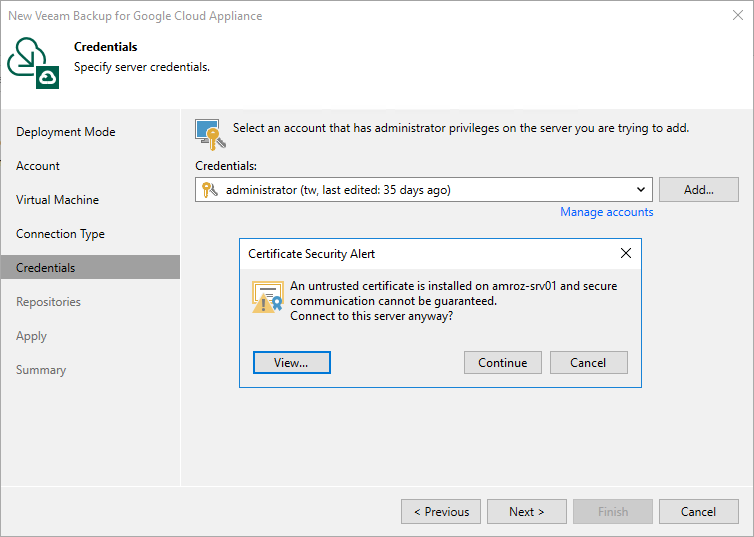

In this article

If Veeam Backup & Replication encounters an issue while verifying the connection to the specified backup appliance, you may get one of the following warnings.

Version Compatibility Alert

If you try to add to the backup infrastructure an appliance whose version is not compatible with the Veeam Backup & Replication version, Veeam Backup & Replication will display a warning notifying that the appliance must be upgraded. To eliminate the warning, click Yes — Veeam Backup & Replication will automatically upgrade the appliance to the necessary version.

Certificate Security Alert

When you add a backup appliance to the backup infrastructure, Veeam Backup & Replication saves in the configuration database a thumbprint of the TLS certificate installed on the appliance. When Veeam Backup & Replication connects to the appliance, it uses the saved thumbprint to verify the appliance identity and to avoid the man-in-the-middle attack. To learn how to manage TLS certificates, see [Replacing Security Certificates](replacing_security_certificates.md).

If the certificate installed on the backup appliance is not trusted, Veeam Backup & Replication will display a warning notifying that secure connection cannot be guaranteed. You can view the certificate and click Continue — in this case, Veeam Backup & Replication will remember the certificate thumbprint and will further trust the certificate when connecting to the appliance. Otherwise, you will not be able to proceed with the wizard.

|  |
| --- |
| Note |
| When you replace a TLS certificate installed on a backup appliance, this appliance becomes unavailable in the Veeam Backup & Replication console. To make the appliance available again, [modify the appliance settings](editing_appliances.md) to acknowledge the new certificate. For Veeam Backup & Replication to be able further to automatically update the TLS certificate in the Veeam Backup & Replication configuration database, make sure that ingress traffic [is allowed from the Google IAP](https://cloud.google.com/iap/docs/using-tcp-forwarding#create-firewall-rule) through the SSH protocol (IP range 35.235.240.0/20) on the appliance. |

Page updated 2/7/2024

Page content applies to build 7.0.0.47
