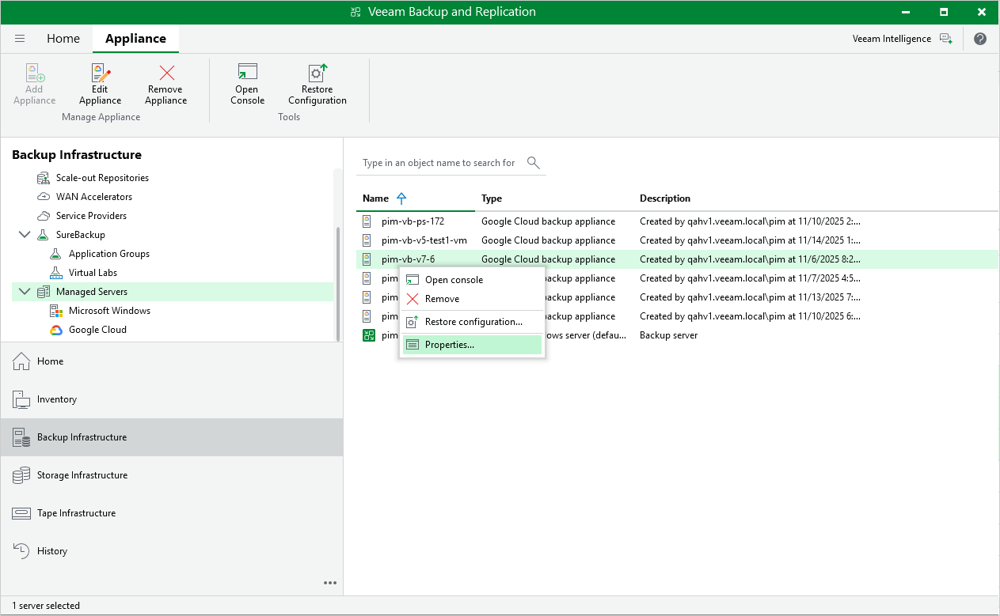

In this article

When you connect to a backup appliance, all repositories that have already been configured on the appliance are automatically added to the backup infrastructure.

If an existing repository is not displayed under the External Repositories node or if you have recently configured a new repository on the appliance that is already connected to the backup server, do the following:

1. In the Veeam Backup & Replication console, open the Backup Infrastructure view.
2. Navigate to Managed Servers.
3. Select a backup appliance that manages the necessary repository and click Edit Appliance on the ribbon.

Alternatively, you can right-click the appliance and select Properties.

1. In the Edit Veeam Backup for GCP Appliance wizard, do the following:

1. Navigate to the Repositories step and provide the required information as described in section [Connecting to Existing Appliances](connect_appliance_repo.md) (step 7).

1. Complete the Edit Veeam Backup for GCP Appliance wizard as described in section [Connecting to Existing Appliances](adding_appliances.md) (steps 8–9).

Open the Backup Infrastructure view to verify that the repository is displayed under the External Repositories node.

Page updated 11/14/2025

Page content applies to build 7.0.0.47
