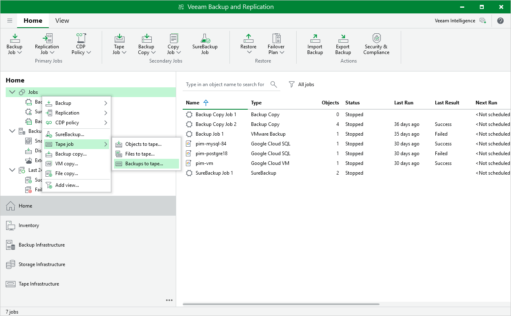

In this article

Veeam Backup & Replication allows you to automate copying of image-level backups of VM instances to tape devices and lets you specify scheduling, archiving and media automation options. For more information on the supported tape libraries, see the Veeam Backup & Replication User Guide, section [Tape Devices Support](https://helpcenter.veeam.com/docs/vbr/userguide/tape_device_support.html?ver=13).

Before you start copying backup to tapes:

* Copy VM instance backups to on-premises backup repositories as described in section [Creating Backup Copy Jobs](backup_copy.md).

* Connect tape devices to Veeam Backup & Replication as described in the Veeam Backup & Replication User Guide, section [Tape Devices Deployment](https://helpcenter.veeam.com/docs/vbr/userguide/tape_deployment.html?ver=13).
* Configure the tape infrastructure as described in steps 1–3 in the Veeam Backup & Replication User Guide, section [Getting Started with Tapes](https://helpcenter.veeam.com/docs/vbr/userguide/getting_started_with_tapes.html?ver=13).

To copy VM instance backups to tapes, create a backup to tape job as described in the Veeam Backup & Replication User Guide, section [Creating Backup to Tape Jobs](https://helpcenter.veeam.com/docs/vbr/userguide/creating_backup_to_tape_jobs.html?ver=13).

Page updated 11/18/2025

Page content applies to build 7.0.0.47
