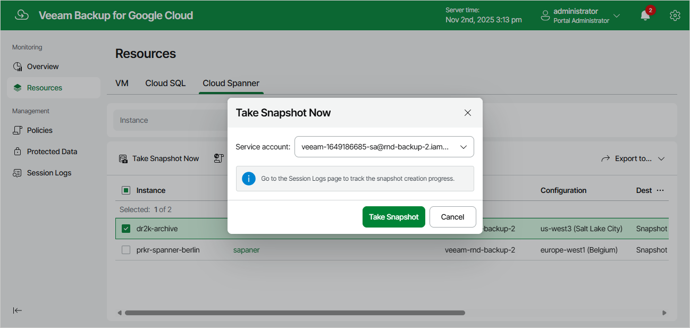

# Creating Snapshots Manually

Veeam Backup for Google Cloud allows you to manually create snapshots of Cloud Spanner instances. Each snapshot is stored in the location that depends on the [regional configuration](https://cloud.google.com/spanner/docs/backup#key-features) of the processed instance.

|  |
| --- |
| Note |
| Veeam Backup for Google Cloud does not include snapshots created manually in the snapshot chain and does not apply the [configured retention policy settings](spanner_policy_schedule.md) to these snapshots. This means that the snapshots are kept in Google Cloud Storage unless you remove them manually, as described in section [Removing Backups and Snapshots](managing_data_ui.md#removing). |

To manually create a cloud-native snapshot of a Cloud Spanner instance, do the following:

1. Navigate to Resources > Cloud Spanner.
2. Select the necessary instance and click Take Snapshot Now.

For a Cloud Spanner instance to be displayed in the list of available instances, it must reside in any of the regions added to a backup policy as described in section [Creating Backup Policies](spanner_policy_regions.md).

1. In the Take Snapshot Now window, select a service account whose permissions Veeam Backup for Google Cloud will use to create the snapshot, and click Take Snapshot.

For a service account to be displayed in the Service account drop-down list, it must be added to Veeam Backup for Google Cloud as described in section [Adding Service Accounts](adding_service_accounts.md), and must be assigned the Cloud Spanner Instances Snapshot operational role as described in section [Adding Projects and Folders](adding_projects.md).

