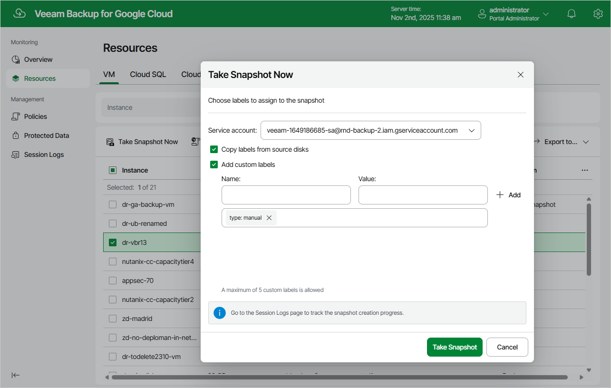

In this article

Veeam Backup for Google Cloud allows you to manually create snapshots of VM instances. Each snapshot is saved to the multi-regional location closest to the region in which the original VM instance resides.

|  |
| --- |
| Note |
| Veeam Backup for Google Cloud does not include snapshots created manually in the snapshot chain and does not apply the [configured retention policy settings](backup_policy_schedule.md) to these snapshots. This means that the snapshots are kept in Google Cloud Storage unless you remove them manually, as described in section [Removing Backups and Snapshots](managing_data_ui.md#removing). |

To manually create a cloud-native snapshot of a VM instance, do the following:

1. Navigate to Resources > VM.
2. Select the necessary instance and click Take Snapshot Now.

For a VM instance to be displayed in the list of available instances, it must reside in any of the regions added to a backup policy as described in section [Creating Backup Policies](backup_policy_regions.md).

1. In the Take Snapshot Now window:

1. Specify a service account whose permissions Veeam Backup for Google Cloud will use to create the snapshot.

For a service account to be displayed in the list of available accounts, it must be added to Veeam Backup for Google Cloud as described in section [Adding Service Accounts](adding_service_accounts.md), and must be assigned the VM Instances Snapshot operational role as described in section [Adding Projects and Folders](adding_projects.md).

1. Choose whether you want to assign labels to the created snapshot:

* To assign already existing labels from the source persistent disk attached to the selected VM instance, select the Copy labels from source disks check box.
* To assign your own custom labels, select the Add custom labels check box and specify the labels explicitly. To do that, use the Name and Value fields to specify a key and a value for the new custom label, and then click Add.

1. Click Take Snapshot.

Page updated 11/11/2025

Page content applies to build 7.0.0.47
