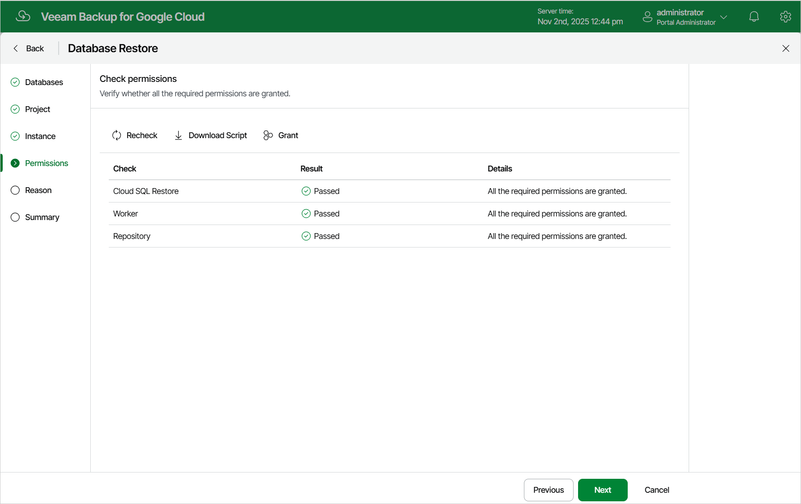

In this article

At the Permissions step of the wizard, Veeam Backup for Google Cloud will verify whether the specified service account has all the necessary permissions required to perform data recovery tasks for the selected project. For more information on the required permissions, see [Service Account Permissions](restore_permissions.md).

To see the list of missing permissions that must be granted to the service account in order to perform an operation, click the link in the Details column. You can grant the missing permissions to the service account [using the Google Cloud console](https://cloud.google.com/iam/docs/granting-changing-revoking-access) or instruct Veeam Backup for Google Cloud to do it:

* To grant the missing permissions manually, click Download Script. Veeam Backup for Google Cloud will generate a gcloud script that you can run in the Google Cloud console to assign all the necessary permissions to the service account.

The account under which you run the script must have the permissions required both to get and set project IAM policies and to create custom IAM roles (for example, it can have the iam.securityAdmin and iam.roleAdmin roles assigned). To learn what permissions and roles are required to create custom roles in IAM, see [Google Cloud documentation](https://cloud.google.com/iam/docs/understanding-custom-roles).

* To let Veeam Backup for Google Cloud grant the missing permissions automatically, click Grant and then click Sign in with Google in the Grant permissions window. You will be redirected to the OAuth consent screen authorization page. Sign in using credentials of a Google account that will be used to grant the permissions.

The account under which you sign in to Google Cloud must have the permissions required both to get and set project IAM policies and to create custom IAM roles (for example, it can have the iam.securityAdmin and iam.roleAdmin roles assigned). To learn what permissions and roles are required to create service account, see [Google Cloud documentation](https://cloud.google.com/iam/docs/understanding-custom-roles).

|  |
| --- |
| Note |
| For Veeam Backup for Google Cloud to be able to authorize in Google Cloud, the OAuth consent screen must be configured as described in section [Registering Applications](registering_applications.md). Note that Veeam Backup for Google Cloud does not store in the configuration database the provided Google account credentials and access tokens received during authorization. |

To make sure that the missing permissions have been successfully granted, click Recheck.

Page updated 11/4/2025

Page content applies to build 7.0.0.47
