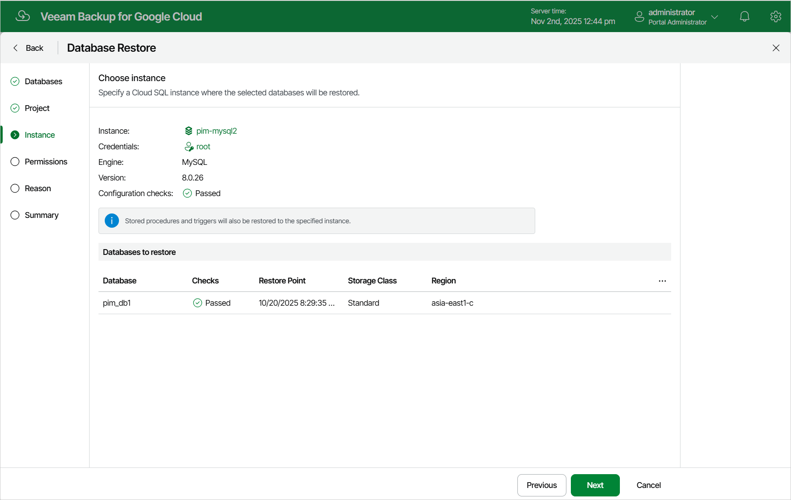

In this article

At the Instance step of the wizard, choose a Cloud SQL instance that will host the restored databases. To do that, click the link in the Instance field, select the necessary Cloud SQL instance from the Choose Cloud SQL instance list, and click Apply. For a Cloud SQL instance to be displayed in the list of available instances, it must belong to the selected project and be running on a supported database engine.

|  |
| --- |
| Notes |
| * Restore to Cloud SQL instances configured to accept SSL connections is not supported. * PostgreSQL databases can be restored only to PostgreSQL instances running the same database engine version. |

You must also specify a Cloud SQL account whose credentials will be used to perform the restore operation. To do that, click a link in the Credentials field and choose an account from the list of available Cloud SQL accounts. For an account to be displayed in the list, it must be added to Veeam Backup for Google Cloud as described in section [Adding Cloud SQL Accounts](add_sql_accounts.md). If you have not added the necessary account to Veeam Backup for Google Cloud beforehand, you can do it without closing the Database Restore wizard. To do that, click Add and complete the Add Account wizard.

|  |
| --- |
| Tip |
| Veeam Backup for Google Cloud will perform a number of configuration checks for the selected instance and databases:   * If any of the checks fail to complete successfully for an instance, the wizard will display an error in the Configuration checks field. * If any of the checks fail to complete successfully for a database, the wizard will display an error in the Checks column of the Databases to restore table.   You can click the link to get more information on an error. |

Page updated 11/4/2025

Page content applies to build 7.0.0.47
