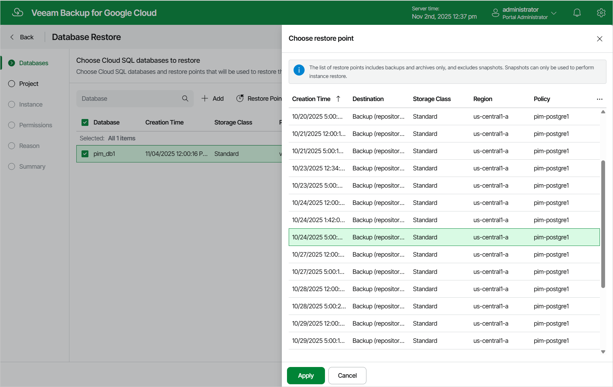

# Step 2. Select Databases

At the Databases step of the wizard, click Add to select databases to restore, and then choose a restore point that will be used to restore the selected databases. By default, Veeam Backup for Google Cloud uses the most recent valid restore point. However, you can restore the backed-up data to an earlier state.

To select a restore point, do the following:

1. Select a database and click Restore Point.
2. In the Choose restore point window, select the necessary restore point and click Apply.

To help you choose a restore point, Veeam Backup for Google Cloud provides the following information on each available restore point:

* Creation Time — the date when the restore point was created.

* Destination — the type of the restore point:

* Snapshot — a cloud-native snapshot created by a backup policy.
* Manual Snapshot — a cloud-native snapshot created manually.
* Backup — an image-level backup created by a backup policy.
* Archive — an archived backup created by a backup policy.

* Storage Class — the storage class of the backup repository where the restore point is stored (applies only to image-level backups).
* Region — a region in which the protected Cloud SQL instance resides.
* Policy — a backup policy that created the restore point.
* Retention — a retention configured for the backup policy that created the restore point.

|  |
| --- |
| Note |
| Veeam Backup for Google Cloud does not support restore of the postgres database, that is, the default database automatically added to PostgreSQL instances upon creation. Consider that it is not recommended to use this database to store any data. For more information, see [Google Cloud documentation](https://cloud.google.com/spanner/docs/create-manage-databases). |

