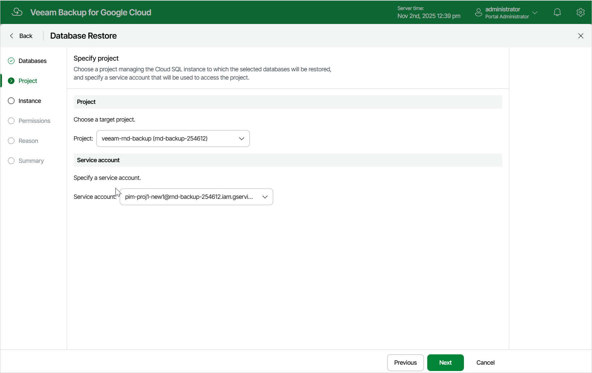

# Step 3. Select Project

At the Project step of the wizard, select a project that manages a Cloud SQL instance to which you want to restore the selected databases and specify a service account whose permissions will be used to perform the restore operation. For more information on the required permissions, see [Service Account Permissions](restore_permissions.md).

For a project to be displayed in the Project drop-down list, it must be added to Veeam Backup for Google Cloud as described in section [Adding Projects and Folders](adding_projects.md).

For a service account to be displayed in the list of available accounts, it must be added to Veeam Backup for Google Cloud as described in section [Adding Service Accounts](adding_service_accounts.md), and must be assigned the Cloud SQL Instances Restore operational role as described in section [Adding Projects and Folders](adding_projects.md).

