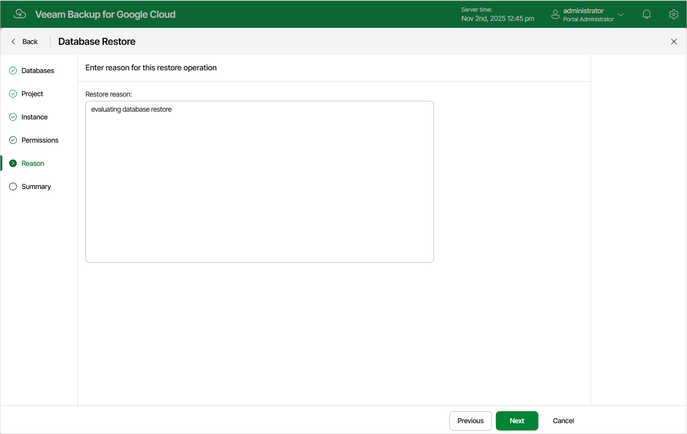

In this article

At the Reason step of the wizard, specify a reason for restoring the Cloud SQL databases. This information will be saved to the session history, and you will be able to reference it later.

Page updated 11/4/2025

Page content applies to build 7.0.0.47
