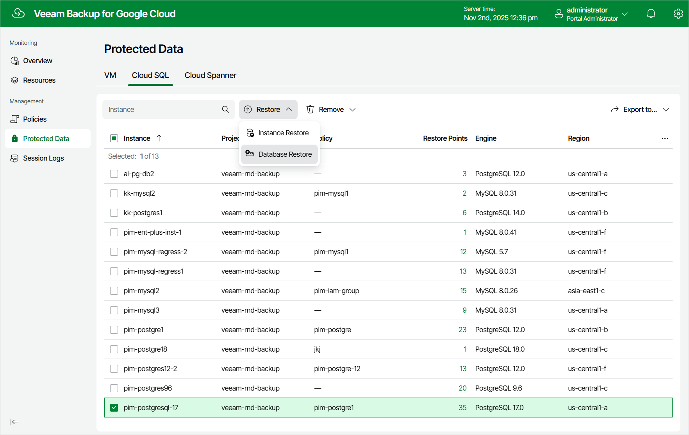

In this article

To launch the Database Restore wizard, do the following:

1. Navigate to Protected Data > Cloud SQL.
2. Select the Cloud SQL instance whose databases you want to restore, and click Restore > Database Restore.

Page updated 11/13/2025

Page content applies to build 7.0.0.47
