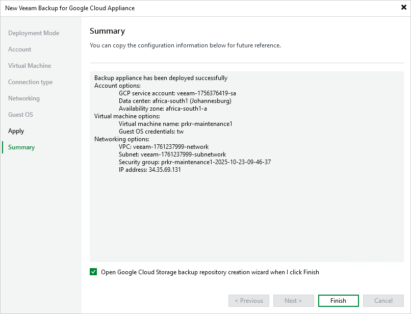

# Step 9. Finish Working with Wizard

At the Summary step of the wizard, review summary information and click Finish. After the backup appliance is deployed, you will be able to configure its settings in the Veeam Backup for Google Cloud Web UI.

|  |
| --- |
| Tip |
| If you want to configure repositories immediately after the backup appliance is deployed, select the Open Google Cloud Storage backup repository creation wizard when I click Finish check box and follow the instructions provided in section [Adding Repositories](add_standard_repository.md). |

