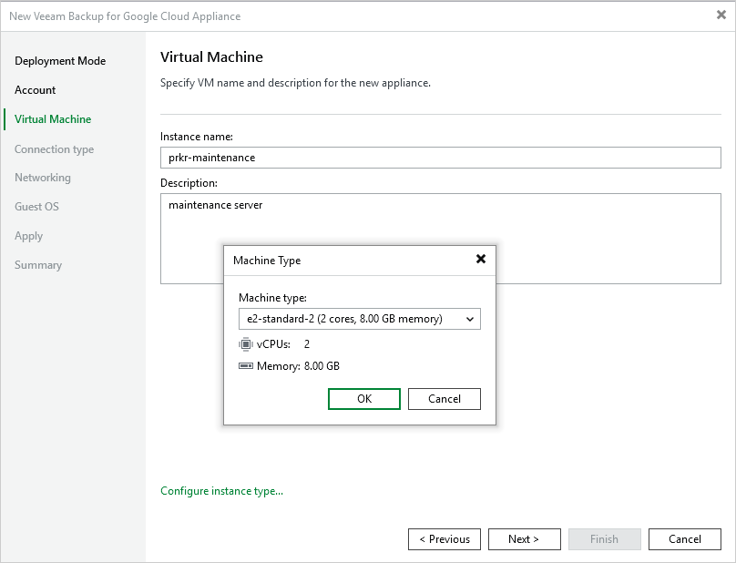

In this article

At the Virtual Machine step of the wizard, specify a name and description for the VM instance where Veeam Backup for Google Cloud will be deployed. Note that the name must meet the [naming convention for Compute Engine resources](https://cloud.google.com/compute/docs/naming-resources).

|  |
| --- |
| Tip |
| By default, Veeam Backup & Replication uses the recommended e2-standard-2 machine type for the backup appliance. If you want to define a specific machine type for the VM instance, click Advanced and select the necessary type in the Machine Type window.  For the list of all existing machine types, see [Sizing and Scalability Guidelines](sizing_guidelines.md). |

Page updated 10/8/2025

Page content applies to build 7.0.0.47
