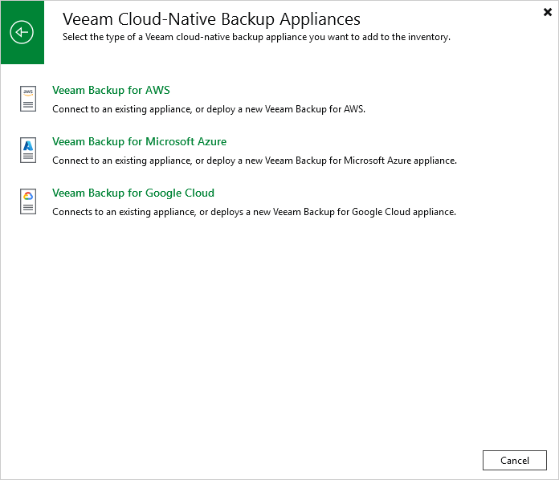

In this article

To launch the New Veeam Backup for GCP Appliance wizard, do the following:

1. In the Veeam Backup & Replication console, open the Backup Infrastructure view.
2. Navigate to Managed Servers and click Add Server on the ribbon.

Alternatively, you can right-click the Managed Servers node and select Add Server.

1. In the Add Server window:

1. [Applies only if you have several cloud plug-ins installed] Click Veeam cloud-native backup appliance.
2. Choose Veeam Backup for GCP.

Page updated 10/8/2025

Page content applies to build 7.0.0.47
