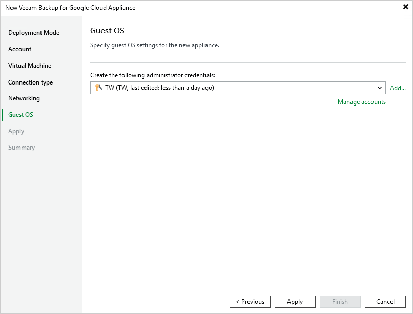

In this article

At the Guest OS step of the wizard, specify a user whose credentials Veeam Backup & Replication will use to create the Default Administrator account on the backup appliance.

For a user to be displayed in the Create the following administrator credentials drop-down list, it must be added to the Credentials Manager as described in the Veeam Backup & Replication User Guide, section [Standard Accounts](https://helpcenter.veeam.com/docs/vbr/userguide/credentials_manager_windows.html?ver=13). If you have not added the necessary user to the Credential Manager beforehand, you can do it without closing the New Veeam Backup for Google Cloud Appliance wizard. To do that, click either the Manage accounts link or the Add button, and then specify the user name, password and description in the Credentials window.

Page updated 11/18/2025

Page content applies to build 7.0.0.47
