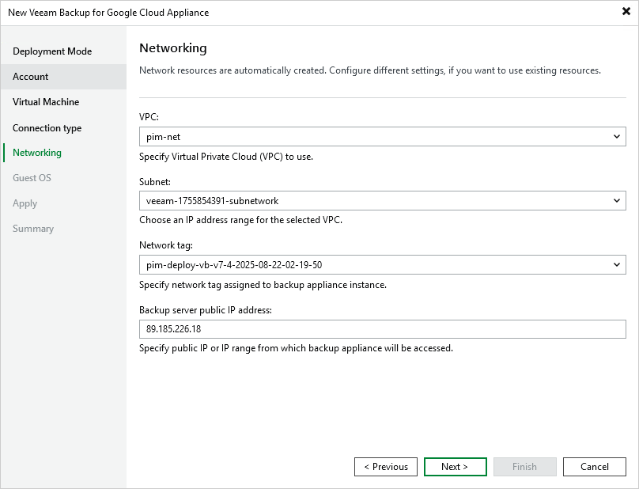

# Step 6. Specify Network Settings

At the Networking step of the wizard, do the following:

1. Choose a virtual private cloud (VPC) network to which the backup appliance will be connected.

You can create a new VPC network or specify an existing one:

* To create a new VPC network, select the (create new) option from the VPC drop-down list. Veeam Backup & Replication will automatically create a network with a set of predefined firewall rules.
* To specify an existing VPC network, select it from the VPC drop-down list. For a VPC network to be displayed in the list of available networks, it must be created in the Google Cloud for the region specified at [step 3](deploy_appliance_account.md) of the wizard, as described in [Google Cloud documentation](https://cloud.google.com/vpc/docs/create-modify-vpc-networks).

1. Choose a subnet to which the backup appliance will be connected.

You can create a new subnet or specify an existing one:

* To create a new subnet, select the (create new) option from the Subnet drop-down list. Veeam Backup & Replication will automatically create a subnet in the specified VPC network.
* To specify an existing subnet, select it from the Subnet drop-down list. For a subnet to be displayed in the list of available subnets, it must be created in the specified VPC network as described in [Google Cloud documentation](https://cloud.google.com/vpc/docs/create-modify-vpc-networks#subnet-rules).

|  |
| --- |
| important |
| If you are using a Shared VPC network, both the service account specified at [step 3](deploy_appliance_account.md) and the Google APIs service account must have one of the following role combinations assigned to them:   * compute.networkUser role for the whole Shared VPC host project * compute.networkViewer role for the whole host project and compute.networkUser for specific subnets in the host project.   To learn how to provide access to Shared VPC networks, see [Google Cloud documentation](https://cloud.google.com/vpc/docs/provisioning-shared-vpc#networkuseratproject). |

1. Choose a network tag that will be assigned to the backup appliance.

You can create a new tag or specify an existing one:

* To create a new tag, select the (create new) option from the Network tag drop-down list. Veeam Backup & Replication will automatically create a tag with the appliance name.

If you have chosen to connect the backup appliance to a shared VPC network, Veeam Backup & Replication will not be able to create a new network tag with required firewall rules automatically while deploying the appliance. That is why you must either specify an existing network tag, or configure firewall rules associated with the selected VPC manually.

* To specify an existing tag, select it from the Network tag drop-down list. For a tag to be displayed in the list of available tags, it must be created in Google Cloud as described in [Google Cloud documentation](https://cloud.google.com/vpc/docs/add-remove-network-tags).

|  |
| --- |
| Important |
| If you specify an existing network tag, consider that the following firewall rules must apply to the tag:   * A rule that allows outbound internet access from the backup appliance to Google Cloud APIs listed in section [Planning and Preparation](google_cloud_apis.md). * A rule that allows inbound internet access to the backup appliance from both the backup server and a local machine that you plan to use to work with Veeam Backup for Google Cloud. * A rule that allows inbound internet access from the Google IAP to the backup appliance through the SSH protocol (IP range 35.235.240.0/20) to perform backup appliance deployment and receive automatic updates of the TLS certificates installed on the appliance. For more information on the Google IAP, see [Google Cloud documentation](https://cloud.google.com/iap/docs/using-tcp-forwarding#create-firewall-rule).   To learn how to create firewall rules, see [Google Cloud documentation](https://cloud.google.com/vpc/docs/using-firewalls#creating_firewall_rules). |

1. [Applies only if you have chosen to create a new network tag] In the Backup server public IP address field, specify an IP address or a scope of IP addresses that will be allowed to access the backup appliance. Veeam Backup & Replication will create a firewall rule for the specified IP addresses. Note that the IP address of the backup server must fall into the specified IP address range.

The IPv4 address ranges must be specified in the CIDR notation (for example, 12.23.34.0/24). To specify multiple IP addresses or multiple scopes of IP addresses, use a comma-separated list.

