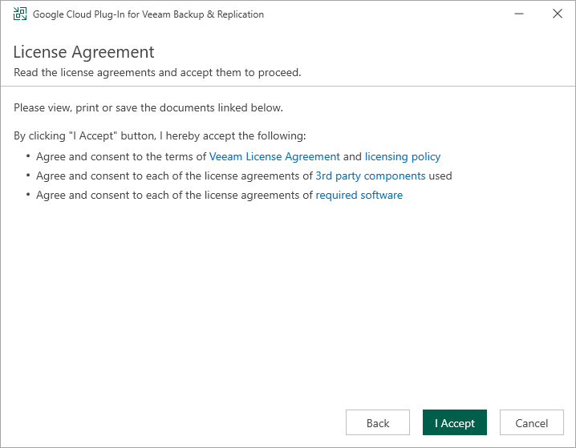

# Deploying Plug-In

If your installation package of Veeam Backup & Replication does not provide features that allow you to protect Google Cloud resources, you must install Veeam Plug-in for Google Cloud on the backup server to be able to add your backup appliances to the backup infrastructure.

|  |
| --- |
| Note |
| Before you install Veeam Plug-in for Google Cloud, stop all running backup policies, disable all jobs, and close the Veeam Backup & Replication console. |

To install Veeam Plug-in for Google Cloud, do the following:

1. Log in to the backup server using an account with the local Administrator permissions.
2. In a web browser, navigate to the [Veeam Backup & Replication: Download page](https://www.veeam.com/backup-replication-vcp-download.html.), switch to the Cloud Plug-ins in the Additional Downloads section, and click the Download icon to download Veeam Plug-in for Google Cloud.
3. Open the downloaded GCPPlugin\_13.7.0.281.zip file and launch the GCPPlugin\_13.7.0.281.exe installation file.

1. Complete the Veeam Plug-in for Google Cloud wizard:

1. At the License Agreements step, read and accept both the Veeam license agreement, licensing policy, the 3rd party components that Veeam incorporates, and the license agreements of required software. If you reject the agreements, you will not be able to continue installation.
2. At the Installation Path step, you can specify the installation directory. To do that, click Browse. In the Browse for folder window, select the installation directory for the product or create a new one, and click OK.
3. At the Ready to Install step, click Install to begin installation.

Related Topics

[Installing Plug-In in Unattended Mode](install_unattended.md)

