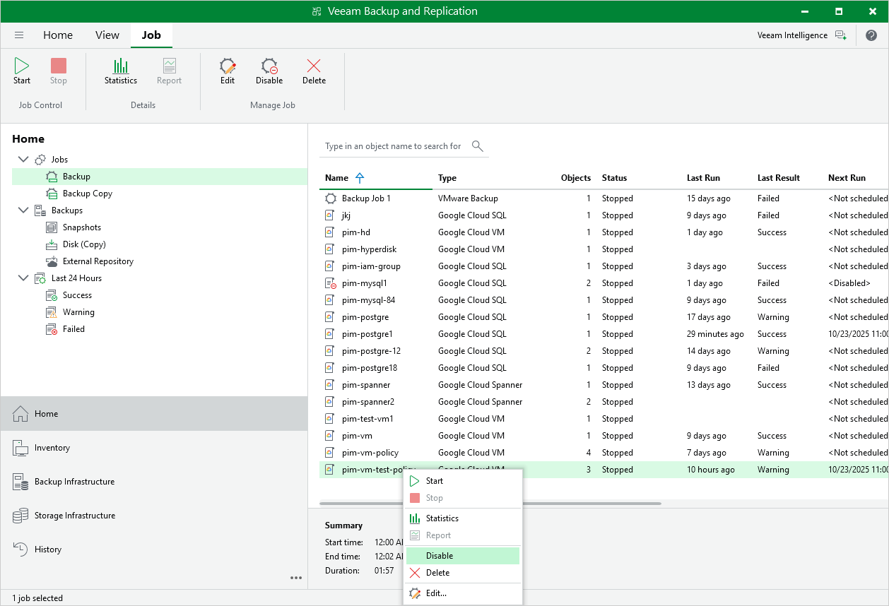

# Enabling and Disabling Backup Policies

By default, Veeam Backup for Google Cloud runs all created backup policies according to the specified schedules. However, you can temporarily disable a backup policy so that Veeam Backup for Google Cloud does not run the backup policy automatically. You will still be able to [manually start](starting_and_stopping_policies.md) or enable the disabled backup policy at any time you need.

To disable an enabled backup policy or to enable a disabled backup policy, do the following:

1. In the Veeam Backup & Replication console, open the Home view.
2. Navigate to Jobs.
3. Select the necessary backup policy and click Disable on the ribbon.

Alternatively, you can right-click the necessary backup policy and select Disable.

